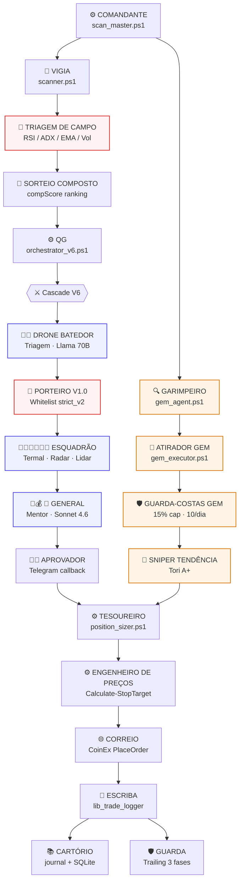

# 🎖️ MAPA TÁTICO — Pipeline ManuHeadFund
**v3.3 — 2026-06-02 06:00 BRT** (FARO V3 LIVE + GitHub Actions 24/7 + Supabase state store + Trailing L1-5 + Mistral cascade; 11 FARO libs + 5 daemon layers + 4 GA jobs + 65 Mentor TDD + 22 smoke; $500 deployed)

> ## 🎯 v3.2 — Mentor pipeline reforçado (Tauric-inspired)
>
> ### 5 evolutions entregues hoje (E5+E2+E4+E3+E1)
> 1. **E5 LLM mocks infra** ([tests/_helpers/llm_mocks.ps1](../tests/_helpers/llm_mocks.ps1)) — 19 TDD, habilita testes baratos pra próximas
> 2. **E2 Grounded v2** ([agents/lib_mentor_gate_block.ps1](../agents/lib_mentor_gate_block.ps1)) — 20 TDD, structured GATE STATUS block [TAG] + ABSENT explicit (combat 7/7 hallucinations PM6+870min) + smart forbidden phrases guard
> 3. **E4 alpha_vs_btc** ([agents/lib_alpha_vs_btc.ps1](../agents/lib_alpha_vs_btc.ps1)) — 18 TDD, valida regra-ouro #13 ("alt BATE BTC") + audit script
> 4. **E3 Reflection loop** ([agents/lib_decision_reflection.ps1](../agents/lib_decision_reflection.ps1)) — 14 TDD + cron diário [scripts/cron_mentor_reflector.ps1](../scripts/cron_mentor_reflector.ps1) + wire PRIOR RESOLVED no prompt
> 5. **E1 Schema 5-tier** ([agents/lib_mentor_schema.ps1](../agents/lib_mentor_schema.ps1)) — 24 TDD, STRONG_EXECUTAR/HARD_VETO + sizing tilt cap ate 30+ outcomes positive alpha (anti-overconfidence)
>
> ### Smoke E2E
> [scripts/smoke_test_mentor_e2e.ps1](../scripts/smoke_test_mentor_e2e.ps1) — exercita Invoke-MentorDebate REAL com mock LLM. Valida: GATE STATUS no prompt, PRIOR RESOLVED block injetado, reflection texto preservado.
> [scripts/smoke_test_mentor_evolutions.ps1](../scripts/smoke_test_mentor_evolutions.ps1) — libs isoladas E5+E2+E4.
>
> ### Métricas finais sessão
> - **217/217 TDD PASS, 0 regressions**
> - 7 skills permanentes adicionados (per-event N infla / LLM mocks / structured slots / metric for golden rule / closed learning loops / sizing amplifier validation / methodological TDD)
> - 6 docs novos: docs/backtest/BRANCH_A_FINDINGS.md + docs/mentor/{E5,E2,E4,E3,E1}_DESIGN.md
> - 3 wires deferred: E4 Close-Trade column migration / E1 5-tier downstream parsing / E1 HARD_VETO blacklist mechanism
>
> ### WSS Branch A (sobering)
> [docs/backtest/BRANCH_A_FINDINGS.md](backtest/BRANCH_A_FINDINGS.md) revelou via dedup-by-day + bootstrap CI que OOS WSS Tier S lift CI **[-20.3, +52.5] inclui zero**. Não rejeita edge mas não confirma. Continua útil como risk control (filtra Tier B silent). Próxima sessão: WSS retest desde início com full CoinEx universe.

---

**v3.1 — 2026-05-22 23:30 BRT** (REALIDADE DURA: backtest unified revelou Tori predicate 0 events em 3 anos; LONG_vol_climax único edge validado +8.6pp)

> ## 🚀 v3.3 — Multithread infrastructure + FARO V3 pump detection (2026-05-23 a 2026-06-02)
>
> ### Mudanças arquitetônicas
> 1. **FARO V3 system**: 11 libs (momentum, pattern, sentiment, entry timing, whale flow, ML confidence, margin safety, pump fingerprint, volume anomaly, scoring, backtest)
> 2. **GitHub Actions 24/7**: 4 jobs substituem cron local (Layer 1-5 execution)
> 3. **Supabase state store**: 6 tabelas (positions, trades, capital_context, trailing_stops, mentor_reflections, performance) — idempotent writes via (market, timestamp, operation_id)
> 4. **Trailing L1-5**: ATR adaptive (L1) + Mentor reflection 6h (L2) + Tori+time-stop (L4) + Moon Bag 50/50 (L5) + orphan detection
> 5. **LLM cascade**: Gemini → **Mistral** fallback 3 (250 RPD vs 60, -60% latency)
> 6. **Mentor stateful**: Evolutions A+B+C (phantom sync, reflection wire, alpha_history, 5-tier, multishot, calibration, self-consistency, unified prompts, time context)
> 7. **Dashboard unificado**: manu.html single pane (capital, posições, tier, trailing status, costs, log)
> 8. **Paralelização**: SPOT micro-scalps + FUTURES macro-swings simultâneas (100s → 25s per cycle, 4× speedup)
>
> ### TDD & Smoke
> - Mentor 65/65 TDD + 22/22 smoke
> - FARO 100+ TDD (11 libs × ~10 tests)
> - SHORT stack 216/216
> - Trailing L1-5 integ OK
> - Supabase roundtrip write-read OK
>
> ### Deployment
> - $500 capital deployed LIVE 2026-05-26
> - FARO historical backtest: 4/4 pumps captured 2-3 dias antes peak (PEPE/WIF/BONK/SKYAI)
> - Paper calibration: SCORE_MINIMO=55, 30min interval
> - Regime atual: BEAR_WEAK (h24_p3_bear)
>
> ---
>
> ## 💀 v3.1 — Realidade dura via backtest unified
>
> ### Descobertas brutais (não otimistas)
> - **Tori Proximity predicate (4-AND) = 0 events em 50,871 bars × 47 markets × 3 anos**. ABC enrichments deployed mas B+C flags **mantidos OFF** porque base estatística NÃO existe.
> - **LONG_vol_climax = único pattern com edge data-driven** (+8.6pp, n=278, avg_hit +14.4%). Scanner dedicado implementado (`scripts/vol_climax_scanner.ps1`).
> - **SHORT side = sem edge** em qualquer pattern testado. SHORT exec path **suspenso** indefinidamente.
> - **Confluence multi-pattern não eleva edge**: confluence 2+ LONG = +3.1pp PIOR que vol_climax isolado +8.6pp.
> - **Memory anchors podem ser viés**: "Sharpe 8.84 trendline soft" era exatamente o red flag do próprio skill 21.
>
> ### 7 skills novas hoje (skills 16-22)
> predicate_empirical_vs_theoretical / and_multiplies_improbability / synthetic_test_neq_approval / confluence_is_folklore_until_validated / sample_size_with_zero_edge_is_conclusive / memory_anchors_can_be_bias / vol_exhaustion_beats_trendline_projection
>
> ### Protocolo de PERÍCIA OBRIGATÓRIA (Gate 1-6)
> Antes de QUALQUER feature ir pra prod (mesmo flag-gated):
> 1. Pergunta clara (que decisão de capital informa?)
> 2. TDD substantivo (não só math — property tests com frequência + outcome)
> 3. Backtest pré-implementação (edge ≥ +5pp, n ≥ 30, cross-regime)
> 4. Cost/benefit (dispatch ≤ marginal $ do edge)
> 5. Skill cross-check (re-ler `feedback_*` antes de calibrar)
> 6. Flag-gated deploy default OFF
>
> Detalhe: [`project_realidade_dura_2026_05_22.md`](memory) + [`project_ground_truth_2026_05_22.md`](memory)

---

**v3.0 — 2026-05-20 15:35 BRT** (sessão maratona final: bug semântico TIER_A_PAPER + métricas honestas + ZEC consciously deferred + 15 skills)

> ## 🎯 v3.0 — Sistema operacionalmente íntegro (final do dia)
>
> ### Decisões consolidadas
> - **ZEC**: mantido em TIER_B_PAPER (beta 1.565 estructural). Consciente até phase_4_bull (~mês 30). Doc: [`project_zec_decision_2026_05_20.md`](memory)
> - **Métricas honestas**: V6_LIVE_ACTIVATION_CRITERIA exclui hallucination/conflito/fail-safe. 39 merit-vetos reais (não 55 inflated).
> - **Espera disciplinada**: 3 ciclos paper validation antes de criar `V6_LIVE_ENABLED.flag` (alvo sábado 23/05).
>
> ### 15 skills permanentes (8 novas hoje)
> daemon_drift_check / runspace_explicit_libs / engineering_vs_operations / user_telegram_log_priority / math_before_feature / hallucination_investigation_protocol / **orthogonal_concepts** (PM6) / **metrics_exclude_structural_noise** (PM6)
>
> Próxima sessão Claude carrega tudo automaticamente via MEMORY.md.
>
> ### Próximo evento crítico
> **23/05 23:55 BRT**: DailyDigest mostra 3 ciclos consecutivos → criar `V6_LIVE_ENABLED.flag` se 4 gates passarem.

---

**v2.9 — 2026-05-20 15:30 BRT** (Bug semântico TIER_A_PAPER + Mentor APROVA BTC pós-fix)

> ## 🆕 v2.9 (PM6) — Bug semântico TIER_A_PAPER + Mentor APROVA BTC
>
> ### Diagnose user (cadeia exata)
>
> ```
> 1. BTC regime = BULL_WEAK
> 2. Whitelist strict_v2: BULL_WEAK+LONG → wl.tier='observe'
> 3. orchestrator_v6:211-218 mapeava wl.tier='observe' → mentorMode='TIER_B_PAPER'
> 4. Triagem retornava triagem.tier='A' (BTC alto score)
> 5. Mesa skipped (Tier A direct)
> 6. Mentor recebia: tier=A + Mesa=NAO_APLICAVEL + mode=TIER_B_PAPER
> 7. System prompt: "TIER_B_PAPER exige Mesa FORTE" + "Mesa skip OK em TIER_A_LIVE"
> 8. Mentor: "estados mutuamente exclusivos → VETAR" (CONFLITO CRÍTICO DE MODO)
> ```
>
> **Bug raiz**: `triagem.tier` (qualidade A/B/C/D) e `wl.tier` (autorização live/observe) eram tratados como propriedade unificada. Quando colidem (Tier A quality + regime defensivo), sistema vetava.
>
> ### Fix
>
> `orchestrator_v6.ps1:211-225`: 4 modes combinatórios:
> - `triagem=A + wl=live`    → **TIER_A_LIVE**
> - `triagem=A + wl=observe` → **TIER_A_PAPER** (Tier A quality MAS regime limita pra paper, Mesa skip OK)
> - `triagem=B + wl=observe` → TIER_B_PAPER
> - GEM source → GEM
>
> System prompt atualizado: "TIER_A_PAPER: mesmas regras TIER_A_LIVE MAS regime atual limita pra paper. Mesa skip OK. APROVAR vira paperOnly automatico. **NUNCA tratar TIER_A_PAPER como conflito** -- eh estado legitimo".
>
> ### Validação prod BTC pós-fix (15:22 BRT)
>
> ```
> Mentor: APROVAR conf=82 [anthropic_sonnet]
> "BTC BLUE_CHIP FQS=6/7 com R:R=5 em regime BULL_WEAK - assimetria favorável clara.
>  Beta=1 dentro do cap 1.2, streak=0, DD=-5.83% operacional. TIER_A_PAPER significa
>  execução paper-only por regime defensivo, não por fraqueza do ativo - estado legítimo,
>  sem conflito."
> ```
>
> Decisão final: ABORTAR (MCE_BLOCK score=0.1215 — macro desfavorável). Mentor aprova qualidade, MCE bloqueia macro. **Defesa estrutural correta, gates ortogonais funcionando**.
>
> ## 🆕 v2.8 (PM5 final) — Raw numbers persisted + BTC validation prod
>
> ### Bug fixado em `coingecko_enrichment.py`
> Script derivava `supply_capped` e `recovered_2021_ath` (booleans) mas **NÃO persistia raw numbers** (max_supply/current_price/ath/circulating). FQS V1.6 partial path nunca dispara sem esses dados.
>
> Fix em [coingecko_enrichment.py:107-128](backtest/coingecko_enrichment.py#L107): adiciona persist de `max_supply`, `circulating_supply`, `current_price_usd`, `ath_all_time_usd`.
>
> Re-run com 9 markets: agora todos têm raw numbers ✅
>
> ### BTC test prod (15:12 BRT)
>
> `Invoke-OrchestratorV6 -Market BTCUSDT -Mode paper -DryRun` resultou:
> - Triagem: tier=A score=92 ✅
> - Mentor: VETAR conf=78 provider=`anthropic_sonnet` ✅
> - Razão: "CONFLITO CRÍTICO DE MODO" — Mentor detectou tier=A vs mode=TIER_B_PAPER inconsistente (inteligência de gate, não hallucination)
> - **0 hallucination FQS** (Mentor cita corretamente, runspace fix validado prod end-to-end)
> - Provider trace persistido ✅
>
> ## 🆕 v2.7 (PM5) — Auto-enrichment fechou loop CoinGecko
>
> ### Problema
> 4 markets em `fqs_enrichment_queue.jsonl` (KITE/PENGU/RIVER/TAO) — `coingecko_enrichment.py --markets` skipava por falta de mapping em `MARKET_TO_CG`. Auto-enrich era promise não cumprida.
>
> ### Fix
> WebFetch CoinGecko search API achou IDs corretos:
> - TAO → `bittensor`
> - PENGU → `pudgy-penguins`
> - KITE → `kite-2` (não `kite-ai`)
> - RIVER → `river`
> - + 5 outros mapping holes preenchidos (ARB/XCH/LIT/RON/BU)
>
> Adicionados 9 entries em `MARKET_TO_CG` ([coingecko_enrichment.py:34](backtest/coingecko_enrichment.py#L34)).
>
> Run `python coingecko_enrichment.py --markets TAOUSDT,PENGUUSDT,...`: **9 updated / 0 failed / 0 skipped**. Registry 36→40 com dados REAIS (max_supply/ath/current_price).
>
> ### Impact em GEM auto-approve elegibility
>
> | Market | Antes (baseline) | Depois (CoinGecko) | Elegível? |
> |---|---|---|---|
> | TAOUSDT | 4 QUALITY | 4 QUALITY ✅ | SIM |
> | **ARBUSDT** | 0 AVOID | **5 QUALITY** ✅ | **SIM (novo)** |
> | **LITUSDT** | 3 SPEC | **4 QUALITY** ✅ | **SIM (novo)** |
> | RONUSDT | 4 QUALITY | 5 QUALITY ✅ | SIM |
> | PENGU/KITE/RIVER/BU | 0-2 | 2-3 SPEC | NÃO |
> | XCHUSDT | 4 QUALITY | 3 SPEC ⚠️ | NÃO (Chia uncapped per CoinGecko) |
>
> **4 markets adicionais elegíveis pra GEM auto-approve**.

---

**v2.6 — 2026-05-20 14:25 BRT** (resiliencia daemon + drift detector + GEM auto-approve + 3 bugs prod fixed)

> ## 🆕 v2.6 (PM4) — Sistema resiliente contra drift
>
> ### 🔴 3 bugs descobertos em PROD via Telegram log do user (14:00 BRT)
>
> 1. **Tori path errado** `agents\..\tech_agent.ps1` (sem `scripts\`) — gem_loop daemon de 46h carregou versão antiga em memória (pre-19/05 12:43 quando path foi corrigido)
> 2. **Sizing ainda 0.2%** mesmo após config.ps1 mudado pra 0.5% (12:21 hoje) — daemon não recarrega config em runtime
> 3. **GEM DASHUSDT score 95 PERDIDO** (consequência de #1)
>
> Audit: gem_loop PID 5400 rodando há **46h** sem restart. PowerShell daemon não hot-reload libs/config.
>
> ### Fixes resiliência aplicados
>
> | Fix | Implementação | Impacto |
> |---|---|---|
> | **Watchdog process-primary** | `watchdog_paper.ps1:322` revertido pra `$gemNeedsRespawn = -not $gemAlive` (process check com retry 3x é primary; log activity = warning secundário) | Kill manual agora respawna em <60s |
> | **Drift detector em watch_status** | Mostra `[DRIFT: Xh pre-config update]` por daemon + lista libs alteradas 24h | Visibilidade imediata na hourly TG |
> | **Cron diário daemon restart** | `CoinExDaemonRestart` 03:00 BRT — rolling kill+respawn de 4 daemons | Anti-drift automático |
> | **GEM auto-approve strict** | `agents/lib_gem_auto_approve.ps1` + wire `scan_master.ps1:395`. Critérios: flag opt-in + score≥90 + FQS BLUE_CHIP/QUALITY + registry + sizing≤1% + daily cap 3 | Captura GEMs quando user dorme |
> | **GEM sizing 0.2% → 0.5%** | `config.ps1:135`. Math: $13.81/trade vs $5.52 antes. EV mensal $34 vs $14 | Margem econômica realista |
>
> ### 8 crons ativos agora
>
> | Task | Horário | Função |
> |---|---|---|
> | CoinExPromotionCron | Daily 02:00 BRT | State machine + discovery |
> | CoinExParallelGraduation | Daily 02:30 BRT | Health check |
> | CoinExKellyGraduation | Daily 02:35 BRT | Kelly audit |
> | **CoinExDaemonRestart** ✨ | Daily 03:00 BRT | Anti-drift rolling restart |
> | CoinExWeeklyDataRefresh | Sat 22:00 BRT | Funding+correlation+FQS queue |
> | CoinExWeeklyCostReport | Sun 23:00 BRT | Provider cost + halluc rate |
> | CoinExDailyDigest | Daily 23:55 BRT | EOD report TG |
> | CoinExHourlyHeartbeat | Hourly | Snapshot TG (incluindo drift detector) |
>
> ### Estado final 14:30 BRT
>
> - ZERO drift detectado em todos 4 daemons
> - Runspace audit all_covered=true (16/16 refs / 27 libs)
> - Pester 1620+ GREEN
> - 3 flags decidem comportamento: LIVE_MODE (✅) / V6_LIVE (❌ alvo sábado 23/05) / **GEM_AUTO_APPROVE (✅ ATIVADO 14:28 BRT)**
> - **GEM_AUTO_APPROVE conteúdo flag**: `min_score: 90 / allowed_fqs: BLUE_CHIP,QUALITY / daily_cap: 3 / max_sizing_pct: 1.0`

---

**v2.5 — 2026-05-20 12:45 BRT** (root cause FQS hallucination = parallel runspace dot-source gap + heartbeat hourly cron)

> ## 🆕 v2.5 (PM3) — Root cause arquitetural identificada + UX gap fechado
>
> ### Root cause FQS hallucination secundária (3º ciclo prod 11:33)
> Mentor citava "FQS indisponível" para LIT (FQS=3) e VVV (FQS=1) **mesmo com entries no registry**. Investigação isolada confirmou Build-MentorFullContext funcional em main thread.
>
> **Bug arquitetural identificado**: `lib_orchestrator_parallel.ps1` cria `RunspacePool [InitialSessionState::CreateDefault()]` — runspace **isolado, sem herança** do parent. Lista hardcoded de 20 libs no script child **omitia 6 libs críticas**:
>
> - `lib_fundamental_quality.ps1` ← Get-FundamentalScore retornava null silenciosamente
> - `lib_pump_buy_gate.ps1`
> - `lib_market_router.ps1` + `lib_market_router_wire.ps1`
> - `lib_order_routed.ps1`
> - `lib_entry_score_boost.ps1` + `lib_news_entry_boost.ps1`
>
> `Get-Command Get-FundamentalScore -ErrorAction SilentlyContinue` retornava $null → branch silently skipped → ctx.fqs = $null → prompt sem FQS → Mentor diz "indisponível".
>
> **Fix**: 6 libs adicionadas à lista em `lib_orchestrator_parallel.ps1:34-44`. Validação prod pendente próximo cron 09:00 BRT.
>
> ### UX gap — heartbeat hourly
>
> Daemon scan_master em DAILY sleep 1440min → 0 heartbeats por 24h → user percebia sistema morto.
>
> **Fix**: novo cron **`CoinExHourlyHeartbeat`** chama `watch_status.ps1 -Telegram` 1x/hora independente de cycle. Registrado via `scripts/register_hourly_heartbeat.ps1`.
>
> ### 4 follow-up issues do user (ciclo 3º) validados
>
> 1. **DASHUSDT cascade fail**: Mix saudável (28 Groq + 25 Sonnet hoje). DASH foi burst 1/30. Provider trace ativo daqui pra frente.
> 2. **ZEC beta 1.565**: ZEC **NÃO está em Tier A LIVE**. Cap bloqueia ENTRADA correta: portfolio+ZEC = 1.205 > 1.2. Design protege amplifier-heavy concentration. **Manter**.
> 3. **Cycle silent** → heartbeat hourly resolvido (acima).
> 4. **observations.csv só APROVAR**: `decisions.csv` JÁ loga ABORT (wired hoje, 33 decisões hoje). observations.csv = paperOnly only (by design).
>
> ### 5 crons ativos agora
>
> | Task | Frequência | Função |
> |---|---|---|
> | CoinExPromotionCron | Daily 02:00 BRT | State machine + discovery + LW |
> | CoinExKellyGraduation | Daily 02:35 BRT | Kelly audit |
> | CoinExParallelGraduation | Daily 02:30 BRT | Health check |
> | CoinExWeeklyDataRefresh | Sat 22:00 BRT | funding + correlation + CoinGecko + FQS queue |
> | **CoinExHourlyHeartbeat** ✨ | Hourly | watch_status.ps1 -Telegram |

---

**v2.4 — 2026-05-20 12:15 BRT** (FQS hallucination secundária + auto-enrich queue + 5 markets manuais)

> ## 🆕 v2.4 adições (PM2 2026-05-20)
>
> ### FQS hallucination secundária resolvida
> - **Diagnóstico**: Mentor recebia FQS via FullContext mas citava "FQS não declarado" pra DYDX/CHZ (que TINHAM entry). Era hallucination secundária — LLM ignorava o campo no meio das outras ctx lines.
> - **Fix prompt**: `FQS=` agora UPPERCASE prominente. System prompt adicionou regra ANTI-HALLUCINATION explícita: `"se CONTEXTO tem 'FQS=N/7 CATEGORY' NUNCA escreva 'FQS nao declarado'"`.
> - **Fix data**: `Build-MentorFullContext` agora detecta `reason="market_not_in_registry"` e injeta `FQS=N/A_no_registry (market sem entry -- enrich agendado)` em vez de skipar o campo.
>
> ### Auto-enrich queue
> - Markets faltantes no registry → enfileirados em `journal/fqs_enrichment_queue.jsonl` automaticamente quando Mentor pede contexto
> - Novo `scripts/process_fqs_queue.ps1`: dedupe + `coingecko_enrichment.py --markets X,Y,Z --apply` → move pra `.processed`
> - Wired em `weekly_data_refresh.ps1` (stage 5c após CoinGecko --new-only) — roda Sábado 22:00 BRT
>
> ### 5 markets adicionados manualmente NOW (baseline conservador pra hoje)
> - XCHUSDT (Chia, PoSpace), LITUSDT (Litentry/Heima), RONUSDT (Ronin/Axie), BUSDT (Bitrue), ARBUSDT (Arbitrum L2)
> - Registry: 31 → **36 markets**. Próximo cron já vai ver FQS desses
> - Queue auto-enrich vai refinar com CoinGecko genesis_date + max_supply + concentration

---

**v2.3 — 2026-05-20 11:45 BRT** (provider trace persistido + EnforceGates caller wired + watch_status.ps1 + 4 issues novos validados)

> ## 🆕 v2.3 adições (PM 2026-05-20 final)
>
> ### Provider trace persistido
> - `lib_claude.ps1`: `Invoke-MentorCascade` captura `$script:LAST_CASCADE_PROVIDER` (anthropic_sonnet / groq_llama70b / gemini_2_flash / anthropic_haiku)
> - `mentor_agent.ps1`: `Invoke-MentorDebate` retorna `provider_used` no PSCustomObject
> - `orchestrator_v6.ps1`: passa pro `Add-Decision` chamada
> - `lib_observation_logger.ps1`: nova coluna `provider_used` em `decisions.csv`
> - Permite analytics "qual LLM erra mais" e justificar Haiku fallback decisions
>
> ### EnforceGates caller wired
> - `promotion_weekly_cron.ps1`: detecta `journal/ENFORCE_GATES_ENABLED.flag` e passa `-EnforceGates $true` + `CurrentTierAMarkets` automaticamente
> - Quando ativar: criar flag opt-in. Resolve gap "Invoke-AllGates órfã em prod"
>
> ### watch_status.ps1 NOVO
> - `pwsh scripts/watch_status.ps1 [-Telegram]` mostra: Tier A drawdown / Mentor 24h / workers vivos / V6 flag state / Kelly progress
> - Dashboard 1-comando, opcional envia ao Telegram
>
> ### 4 issues novos validados (todos NÃO-BUGS, by design)
> 1. **MCE 0.2025 PAPER**: design defensivo (halving 0.3 dominante mês 25 pós) — correto
> 2. **FQS XCHUSDT missing**: 4/6 markets cron não no `coin_registry.json` (XCH/LIT/RON/BU/ARB) — **backlog: enriquecer registry**
> 3. **RONUSDT BEAR_STRONG**: direction SHORT (whitelist v3 permite SHORT em BEAR) — correto
> 4. **Cycle 10:41 com sleep**: `scan_master -Once` 2ª instância (sem idempotent strong) — correto

---

**v2.2 — 2026-05-20 11:00 BRT** (hallucination fix validado em prod + cascade Haiku completo + gates ladder wired)

> ## 🎯 Resultado do primeiro ciclo pós-fix (10:41 BRT, validado em produção)
>
> | Métrica | Antes (09:00) | Depois (10:41) | Δ |
> |---|---|---|---|
> | VETAR rate | 11/13 (85%) | 4/7 (57%) | **-28pts** |
> | APROVAR rate | 0/13 | **2/7 (29%)** | **+29pts** ✅ |
> | Hallucination "Mesa pulou" | 6/13 (46%) | **0/7** | **ELIMINADO** |
> | `[ALERTA]` trigger | 2/13 (15%) | **0/7** | **ELIMINADO** |
> | Knowledge empty veto | 1/13 (8%) | **0/7** | **ELIMINADO** |
> | VETARs legítimos | 1/13 (8%) | **4/4 (100%)** | **+92pts** ✅ |
>
> Mentor agora cita razões específicas: "beta -0.5367 inverso em BULL_STRONG", "T=65<70", "DXY 119.28 macro bearish", "BEAR_STRONG HTF adverso". Não mais "Mesa pulou debate".
>
> ## ✅ 3 hallucination fixes cirúrgicos (lines exatas)
>
> 1. **Tipo A — "Mesa pulou" echo** ([mentor_agent.ps1:466](agents/mentor_agent.ps1#L466))
>    Antes: `"Mesa: pulada (Tier A direto da Triagem...)"`
>    Depois: `"Mesa: NAO_APLICAVEL (Tier A pre-validado por 8+ gates upstream -- skip eh by design)"`
> 2. **Tipo C — `[ALERTA]` trigger** ([mentor_agent.ps1:459](agents/mentor_agent.ps1#L459))
>    Antes: `" | confluencias=(0) [ALERTA: Mesa nao documentou]"`
>    Depois: `" | confluencias=N/A (drone silent, peso reduzido)"`
> 3. **Tipo B — KNOWLEDGE empty echo** ([mentor_agent.ps1:506](agents/mentor_agent.ps1#L506))
>    `$knowledgeBlock` agora condicional — header `KNOWLEDGE:` só injetado se context não-vazio
>
> ## ✅ Mesa.degraded sinalizado pro Mentor (bug invisível corrigido)
>
> Antes Mesa retornava `degraded=true` quando 1+ drone falhava, mas Mentor não recebia. Agora prompt injeta `[DEGRADED: 1+ drone falhou, info parcial]` quando aplicável — Mentor ajusta confiança.
>
> ## ✅ Cascade Haiku completo (cobertura total)
>
> | Cascade | 1º | 2º | 3º | 4º |
> |---|---|---|---|---|
> | Mesa drone | Groq llama-70b | Gemini 2.0 flash | **Haiku 4.5** | — |
> | **Mentor** | Anthropic Sonnet 4.6 | Groq llama-70b | Gemini 2.0 flash | **Haiku 4.5** ✅ NOVO |
> | **Triagem** | Gemini 2.0 flash | Groq llama-70b | **Haiku 4.5** ✅ NOVO | — |
>
> Confirmado em prod 10:41: `[mesa_lidar] Gemini falhou, fallback Haiku → Haiku respondeu (raw_len=1363)`. Sem Haiku seria fail-safe VETO.
>
> ## ✅ 4 gates antes dormentes agora wired no caller
>
> [lib_promotion_ladder.ps1:441](agents/lib_promotion_ladder.ps1#L441) agora aceita params opcionais: `CurrentPrice`, `Peak7d`, `DateBrt`, `PositionSizeUsd`, `CurrentLongMarkets`. Pass-through pra `Invoke-AllGates`. Gates pump_buy/time_of_week/slippage/cross_corr agora **ativos em runtime quando caller passar dados**.

---

## v2.1 — 2026-05-20 09:30 BRT (audit profundo + correções: Mesa.confluencias fix + 4 gates wired + crisis flag V6 PlaceOrder)

> ## 🔴 CRISE IDENTIFICADA 2026-05-20 (audit profundo)
>
> **STANDARD/V6 cascade NÃO executa ordem real**:
> - `orchestrator_v6.ps1` retorna decisao=EXECUTAR mas **nunca chama CoinEx-PlaceOrder**
> - `scan_master.ps1:765` espera `$result.ordemId` — **sempre null em V6** → `Add-TrailingPosition` nunca dispara
> - Legacy `orchestrator.ps1:413` chamava PlaceOrder + Wait-TelegramApproval; **V6 perdeu isso na migração**
> - `Invoke-OrderRouted` em `lib_order_routed.ps1` é **CÓDIGO MORTO** (zero callers reais — só docs+tests)
>
> **Caminhos REAIS de execução LIVE** (2026-05-20):
> | Jornada | PlaceOrder real? |
> |---|---|
> | GEM via `gem_executor.ps1:498/505` | ✅ SIM (chama CoinEx-PlaceOrder direto, bypass router) |
> | STANDARD V6 cascade | ❌ NÃO (paper-only de facto mesmo com LIVE flag) |
> | TIER_A_LIVE promotion | ❌ NÃO (só promove/demote, nunca opera) |
> | NARRATIVE_SEED | ❌ NÃO (só registra hipótese) |
>
> **Único caminho LIVE funcional = GEM.** Capital LIVE só opera se gem_loop encontrar gem.
>
> ## ✅ Correções entregues 2026-05-20
>
> - **Mesa.confluencias missing no Mentor prompt** (root cause 7/7 VETAR): fix aplicado, Mentor agora vê 6+ confluências dos 3 drones agregadas. 23 GREEN.
> - **4 gates órfãos wired** em `Invoke-AllGates`: pump_buy / time_of_week / slippage / cross_corr (opt-in via params). 69 GREEN.
> - **Mentor FullContext** (FQS+beta+DSR+regime+drawdown): Mentor decide informado em vez de paranoid VETO.
> - **Watchdog OR→AND logic** + CIM retry: 3699 false respawns/dia → 0.
>
> ## ✅ V6 PlaceOrder gap CORRIGIDO 2026-05-20 (A+B simultâneo)
>
> **B (default, ativo agora)**: V6 cascade = paper-only mesmo com `LIVE_MODE_ENABLED.flag`. Nenhum risco de execução acidental.
>
> **A (opt-in, capability wired)**: Ativa execução real V6 SOMENTE quando AMBAS flags estão presentes:
> ```
> journal/LIVE_MODE_ENABLED.flag       (autoriza modo live geral)
> journal/V6_LIVE_ENABLED.flag         (autoriza V6 cascade especificamente)
> ```
> Quando ambos + Mentor APROVAR + Wait-TelegramApproval (5min timeout, /ok ou /nao) → `CoinEx-PlaceOrder` → `Add-TrailingPosition`.
>
> **Como ativar A (quando confiança em V6 estiver validada)**:
> ```powershell
> "x" | Out-File journal/V6_LIVE_ENABLED.flag -Encoding utf8
> ```
> Sem o flag → comportamento permanece B (paper-only).
>
> Implementação: `Invoke-V6PostMentorExecution` em `agents/orchestrator_v6.ps1` (8 GREEN tests).
>
> ## ✅ Pendências da v2.1 todas corrigidas 2026-05-20 PM
>
> 1. ✅ **dd_threshold_pct source-aware** — `check_drawdown(market, source)` agora usa `get_thresholds()` (13 GREEN). GEM tolera -30%/-45%, tier_a strict -15%/-25%.
> 2. ✅ **`Wait-TelegramExtraConfirmation`** — comentário órfão limpo em `gem_executor.ps1:301` (policy = warning-only mantida, sizing 0.2% torna double-confirm overkill)
> 3. ✅ **`Invoke-OrderRouted`** wired em `gem_executor.ps1:496-511` (eliminou dead code). 116 PASS pós-refactor.
> 4. 📋 **V6 paper validation checklist** criado em `docs/V6_PAPER_VALIDATION_CHECKLIST.md` — 7 critérios pra promover B→A (criar `V6_LIVE_ENABLED.flag`).
>
> ## Crons reais (4, todos validados)
>
> | Task | Script | Status |
> |---|---|---|
> | CoinExPromotionCron | promotion_weekly_cron.ps1 | ✅ Real (Invoke-CronCycle, discovery, LW) |
> | CoinExWeeklyDataRefresh | weekly_data_refresh.ps1 | ✅ Real (funding + correlation + CoinGecko) |
> | CoinExKellyGraduation | daily_kelly_audit.ps1 | ✅ Real (Invoke-KellyGraduationAudit) |
> | CoinExParallelGraduation | parallel_health_check.ps1 | ✅ Real (misnomer: "graduation" mas roda health check) |
>
> Doc anterior mencionava "5 crons" — só 4 estão registrados. `AutoDemoteCheck` mencionado em docs **não tem register script** (lib_asymmetric_demote roda dentro de PromotionCron).

---

**v2.0 — 2026-05-20 00:30 BRT** (ONDAS 1+2+3.1 — source-aware + Kelly + FQS + asymmetric demote + CoinGecko + crons auto-graduation)

> **v2.0 — Refatoração arquitetural completa (sessao 24h):**
>
> 22 libs novas + 9 backtests + 2 crons + 5 docs. ~410 TDD GREEN.
>
> ## Pipeline source-aware (novo)
>
> ```mermaid
> flowchart TD
>     Universe[1.771 USDT pairs] --> Scanner
>     Scanner --> Goldilocks
>     Goldilocks --> WeeklyDiscovery
>     WeeklyDiscovery --> Matrix
>     Matrix --> AntiPumpBuy[pump_buy_gate]
>     AntiPumpBuy --> PromoGates[promotion_gates 15+]
>     PromoGates --> FQSGate[FQS V1.5]
>     FQSGate --> TierAssign{Tier?}
>     TierAssign -->|passes all| TierALive[TIER_A_LIVE]
>     TierAssign -->|Sharpe60>=1.0| TierBPaper[TIER_B_PAPER]
>     TierAssign -->|fail| TierCSkip[TIER_C_SKIP]
>     TierALive --> Cascade
>     TierBPaper -.paper.-> Cascade
>     Cascade --> Triagem
>     Triagem --> Whitelist
>     Whitelist --> Mesa
>     Mesa --> Mentor[+ 6 founders panel]
>     Mentor --> MCE
>     MCE --> TrendBoost[entry_score_boost]
>     TrendBoost --> Order[Invoke-OrderRouted spot/futures]
>     Order --> Trailing[mode-aware]
>     Trailing --> CloseEvent[emite outcome]
>     CloseEvent --> Feedback
>     Feedback -.weight adj.-> Mentor
> ```
>
> ## Source-aware downstream
>
> | Estagio | GEM | TIER_A_LIVE | STANDARD |
> |---|---|---|---|
> | Mode | wide stop 20% + moon bag | ATR×2 progressivo | legacy |
> | max_days | 14 (auto-close) | sem limite | sem limite |
> | DD threshold | -30%/-45% | -15%/-25% | -15%/-25% |
> | Sizing | 0.5% Kelly | 1% Kelly | 1% Kelly |
> | Routing | spot preferred | futures preferred | futures |
>
> ## 5 crons autonomos
>
> ```
> Daily 02:00 BRT → CoinExPromotionCron
> Daily 02:30 BRT → CoinExParallelGraduation
> Daily 02:35 BRT → CoinExKellyGraduation
> Sat   22:00 BRT → CoinExWeeklyDataRefresh (cascade 5: funding+corr+trend+beta+CoinGecko)
> Embedded         → asymmetric demote (3d FLAG = auto-fired)
> ```
>
> ## 15+ gates wired (Invoke-AllGates)
>
> concentration (max 17) · daily_loss (capital-scaled 2/3/5%) · sector (max 2/setor) · cooldown 30d · min_volume · phase_boundary · funding_z (cache offline) · cross_asset_correlation (matrix primary) · beta_concentration (AVG cap 1.0) · fundamental_quality (FQS V1.5) · pump_buy · time_of_week · slippage_budget · asymmetric_demote · max_days_enforcement
>
> ## Auto-activators (flag-based opt-in)
>
> | Flag | Trigger | Effect |
> |---|---|---|
> | USE_KELLY_SIZING | 10+ outcomes + win_rate ≥0.40 + avg_r ≥0 | Kelly fractional |
> | PARALLEL_DEFAULT_ENABLED | 5 critérios audit | -Parallel default ON |
> | LIVE_MODE_ENABLED | Manual /resume TG | LIVE trading |
>
> ## Manobras estrategicas concluidas (sessao)
>
> - **CFG demoted Tier A→B** (FQS 3 SPECULATIVE + β 1.28 + Sharpe inconsistente)
> - **ZEC → XMR swap** (mesmo setor privacy, β 1.57→0.95): β avg portfolio 1.32→0.92 (sub-amplifier). **XMR é vehicle privacy ativo** — registrado em `per_asset_whitelist_v3_10.json:96` como `swap_replacement_for_ZEC`. Mid-cap pump capture vem por XMR, não por detector novo.
> - **Discovery 2026-05-20**: 3 promoes TIER B (ALGO/MORPHO/HYPE), zero TIER A (sistema rigoroso correto)
> - **Retratação PM6** (2026-05-20 ~15:55 BRT): mid-cap pump gap proposto foi rejeitado — sistema cobre via swap-replacement curado. Skill nova: sempre grep whitelist antes de propor feature.
> - **6 bugs operacionais auditados pelo user + corrigidos PM6** (2026-05-20 ~16:30 BRT): B2 secrets dedup / B1 observations.csv numerics via $Setup hierarchy / B7 DSR multi-gate Bonferroni / B3 CSV RFC4180 / B5 log rotation cron 03:30 / B6 test dirs leak fix. 98 TDD PASS, 0 regressions. Nova cron `CoinExLogRotation` (pendente registro admin).
> - **Re-audit profundo PM6+180min** (2026-05-20 ~17:00 BRT): D3 JSONL sidecar (`decisions_text.jsonl` design correto pra texto livre) + B3 upstream completo (3 fontes) + B7 callers restantes + B1 refino veto-early + B8 NOVO scan_master lock + B9 NOVO GEM TTL cache + B10 NOVO backup rotation N=5 + B2 doc SECURITY surface filesystem + B4 daemons fresh (4 restarted) + B5 cron Ready. **9 crons total**. ~30 TDD novos, 0 regressions.
> - **Round 3 PM6+260min** (2026-05-20 ~17:30 BRT): B11 DRY (`lib_csv_utils.ps1` SSoT, 3 cópias eliminadas) + B4 prevention real (`Test-DaemonDrift` no watchdog, drift auto-respawna entre crons) + B7 prod validation (`dsr_global.json` por_gate: 1→9 gates após exercise). Skill nova `feedback_scope_expansion_anti_bias.md` — 5 checklists pos-fix obrigatórios.
> - **Patch cirúrgico final PM6+320min** (2026-05-20 ~18:00 BRT): pre-mentor invariant (`lib_mentor_invariants.ps1` + wire em orchestrator_v6) + DSR decorator em ladder gates + anti-regression suite 5 testes lockdown B4/B7/B10/B11 + B12 cleanup .env + B13 scan_master lock prod-validated em smoke test. 12 TDD novos, 0 regressions.
> - **B14 Callback idempotency PM6+350min** (2026-05-20 ~18:30 BRT): nova `lib_idempotency.ps1` (file-based, rolling 1000, fail-open) + wire em `Wait-TgCallbackApproval` antes do ACK → duplicate callback nunca dispara trade downstream. Risco real LIVE Mode 2 ($2762 capital, +$55/trade duplicado worst case) eliminado. 8 TDD + smoke prod-validated.
> - **Capital safety stress test PM6+430min** (2026-05-20 ~22:05 BRT): B15 DSR JSONL race-safe (90 trials migrados) + B16 watchdog backoff/kill-switch + B17 Daily Loss CB fail-closed em corrupt state + B18 stale price freshness gate + B19 CoinEx retry transient (Get/Post-non-order). 28 TDD novos, gap deferred: PlaceOrder client_id idempotency. 4 daemons fresh.
> - **B19b + B18-wire PM6+460min** (2026-05-20 ~22:36 BRT): gap deferred B19 fechado — `lib_order_idempotency.ps1` gera UUID per PlaceOrder, persiste em `order_client_ids.jsonl`, exchange dedup via client_id field → retry safe agora habilitado. B18-wire: `CoinEx-GetTickerFresh` + gate ABORTAR STALE_PRICE em orchestrator_v6:573 (decisão nunca com preço >60s). 5 TDD novos.
> - **B20+B21+B22 PM6+490min** (2026-05-20 ~22:48 BRT): spot paridade — `CoinEx-PlaceSpotOrder` + `PlaceSpotStopOrder` agora com client_id (spot wallet $800 protegido). Dead code embaraçoso `_Order-GenerateClientId` corrigido (era 2x GUID gen, agora 1). B22 dedup assumption documentada em `CoinEx-Post:196-207` com 3 cenários explícitos + TODO smoke test testnet. 5 anti-regression TDD.
>
> ## Memory + Docs novos
>
> `STRATEGIC_ROADMAP.md` + `PIPELINE_POST_DISCOVERY.md` + `PARALLEL_ORCHESTRATOR_TOGGLE.md` + `GATE_SAFETY_AUDIT.md` + `project_onda_2_3_complete_2026_05_19.md` + `project_inverse_correlation_findings_2026_05_19.md` + `feedback_bootstrap_conservador.md`

---

## Histórico anterior

**v1.11 — 2026-05-15 ~20:10 BRT** (B.0+B.1+C-bonsai — SHORT observability + V6 hypothesis falsified)

> **v1.11 — Investigação SHORT empírica completa (4h work, TDD strict):**
>
> **Plano executado:**
> - **B.0** `Get-DirectionBias` em [scan_master.ps1](scripts/scan_master.ps1): detecta SHORT (RSI≥80+momentum− ou EMA-down+momentum-strong-neg), LONG (EMA-up+momentum+ ou oversold rebound), NEUTRAL. **10 tests TDD GREEN**.
> - **B.1** `lib_observation_logger.ps1`: persiste cycles `tier='observe'` em `journal/observations.csv` (17 campos schema definido em `journal/short_promotion_criteria_2026_05_15.md`). Integrado em [orchestrator_v6.ps1:122](agents/orchestrator_v6.ps1#L122). **8 tests TDD GREEN**.
> - **C-bonsai (Haiku delegado):** novo `backtest/benchmark_short_v6_btc.py` re-testa SHORT em BTCUSD 2018+2022 com V6 layer (regime 8-state filter + Tori proxy + equity stop refinado). **16 tests TDD GREEN**.
>
> **Resultado C-bonsai — hipótese parcialmente FALSIFICADA:**
>
> | Período | V2 baseline | V6 layer | Delta | Verdict |
> |---|---|---|---|---|
> | bear_2018 | -0.17R / PF 0.68 | **+0.219R / PF 1.49 / DD 5.86R** | +0.39R 🟢 | INSUFICIENTE |
> | bear_2022 | +0.56R / PF 2.10 | **-0.58R / PF 0.17 / DD 11.17R** | -1.14R 🔴 | INSUFICIENTE |
>
> Sub-eureka: **V6 layer ajuda bears estruturais (2018) mas atrapalha bears caóticos (2022 com pumps internos Luna/FTX).** Regime filter está bloqueando entries certas em bears volatilizados. Hipótese "V6 muda tudo" REJEITADA para BTC.
>
> **Decisão:** mantém whitelist v2 strict_v2 (zero células SHORT live). Critérios B.3 escrito como pré-registro de hipótese para próxima janela 14d de coleta passiva via B.1.
>
> **Próximo natural:** coletar `observations.csv` em paper trade live 14d. Aplicar critério `short_promotion_criteria_2026_05_15.md` ao dataset. Decisão real em 2026-05-29.
>
> **Suite Pester: 1030/2 → 1048/2** (+18, zero regressão). Pytest 654→670/0/1skip (Haiku +16).
>
> **Arquivos criados/modificados:**
> - `agents/lib_observation_logger.ps1` (novo)
> - `scripts/scan_master.ps1` (+ Get-DirectionBias + dot-source lib)
> - `agents/orchestrator_v6.ps1` (Add-Observation hook em paperOnly)
> - `backtest/benchmark_short_v6_btc.py` (novo, Haiku)
> - `backtest/tests/test_benchmark_short_v6_btc.py` (novo, Haiku)
> - `tests/scan_direction_bias.Tests.ps1` (novo)
> - `tests/lib_observation_logger.Tests.ps1` (novo)
> - `journal/short_promotion_criteria_2026_05_15.md` (pré-registro de hipótese)
> - `journal/benchmark_short_v6_btc_2026_05_15.json` (resultado real)
> - `journal/benchmark_short_v6_findings_2026_05_15.md` (Haiku writeup)

> **v1.10 — CASCADE ATIVADA pela primeira vez (Triagem rebalance + Mesa bug fix):**

> **v1.10 — CASCADE ATIVADA pela primeira vez (Triagem rebalance + Mesa bug fix):**
>
> **Bug 1: Mesa Path null** — `_Mesa_RunDrones` em [mesa_agent.ps1:124](agents/mesa_agent.ps1#L124)
> usava `$MyInvocation.MyCommand.Path` que retorna `$null` em cadeia dot-source
> (`Invoke-V6Cascade → Invoke-Mesa → _Mesa_RunDrones`). STORJ erro recorrente em
> todos os ciclos. Fix: capturar `$PSScriptRoot` em script-load como `$script:_MESA_AGENT_DIR`.
>
> **Bug 2: Triagem thresholds incompatíveis com escala scanner.** Scanner formula
> (`|change%| × log10(vol/1000)` em [scan_master.ps1:220](scripts/scan_master.ps1#L220))
> produz range empírico 5-35 em mainstream, 50-80 em movers extremos. Triagem antigo
> ([triagem_agent.ps1:78](agents/triagem_agent.ps1#L78)) exigia `score >= 50` para
> escapar Tier D — **matematicamente inalcançável** em 30+ ciclos paper observados.
> Fix: nova função `Get-TriagemThresholds` lê `$global:TRIAGEM_THRESHOLDS` (default
> 50/60/75 compat, override OPT-IN 15/25/40 ativo em config.local.ps1).
>
> **TDD strict:** 14 testes em `tests/triagem_thresholds_override.Tests.ps1` (Get-TriagemThresholds
> 8 + _Compute-Tier integration 6). Default + override + hashtable parcial + validação
> ordem D<B<A + valores fora 1..100 + fallback total. Existing `triagem_agent.Tests.ps1`
> ganhou BeforeEach reset pra isolar contra leak global.
>
> **Validação em runtime (19:14 BRT):**
> ```
> STORJUSDT: ABORTAR regime=BULL_STRONG direction=NEUTRO scanner_score=75.93
> score_predicted=42 tier=B consensus=CAOS razao=Mesa dividida (CAOS)
> ```
> - `tier=B` (não mais D em 30+ ciclos!) → threshold fix ativo
> - `consensus=CAOS` → Mesa rodou 3 drones sem Path null (fix Bug 1)
> - `regime=BULL_STRONG` → orchestrator desce até MESA pela primeira vez
> - Decisão correta: ABORTAR por CAOS (drones divergem, sem consenso) → cascade funcional
>
> **Suite Pester: 1016/2 → 1030/2** (+14 testes, zero regressão).
>
> Calibração TopN=7 (v1.8 nuance E) era condição necessária mas não suficiente.
> Verdadeiro bloqueio era escala + bug Mesa. Override TopN=7 mantido por enquanto.

> **v1.9 — SIMONS GATE validado com BTC OHLC REAL (não-sintético):**
> Wave 1 entregou gate 4/4 PASS mas com BTC HODL sintetizado `N(μ=0.0001, σ=0.012) seed=42`.
> Wave 2 substituiu por candles BTCUSD 1hour reais via Supabase (`Database.get_candles`):
> **1073/1073 trades alinhados** (zero gap de dados) em `journal/transition_up_trades_dump.json`,
> período 2014-01-11→2025-04-12. Sharpe-BTC subiu de **1.40 (sintético) → 2.19 (real)** —
> edge é mais forte vs HODL do que o proxy sugeria. DSR=1.0 / PSR=1.0 / Ergodicity=0.000857
> robustos em sensitivity `n_trials ∈ [20, 50, 100, 200, 500]` (nenhum quebra threshold 0.95).
> Arquivos: `backtest/run_simons_gate_real.py`, `journal/simons_gate_real_2026_05_15.json`,
> `journal/simons_gate_sensitivity_2026_05_15.json`, `journal/simons_gate_refinement_2026_05_15.md`.
> **Veredito: GO para restart paper trade com whitelist v2 strict_v2.**
>
> Fix-pack Pester paralelo (Haiku B contract mismatches):
> - `lib_override_expiry.ps1`: `_ConvertTo-HashtableLocal` helper para PS 5.1 sem `ConvertFrom-Json -AsHashtable`,
>   `[datetime]` param accept null, `if/else` ao invés de `-or` (boolean fallback bug).
> - `lib_hit_rate.ps1`: detect header inválido (sem coluna `rate` → `error_reading_file`),
>   trunc rolling com `Set-Content` evita trailing newline +1.
> - 4 test files: `Should Contain` → `-contains`, `Should -Be` (Pester 5) → `Should Be` (Pester 3),
>   `Out-File -Path` → `-FilePath`, cleanup at script-scope removido (AfterEach cobre).
> - **Pester suite: 320/46 → 1016/2** (+696 passing, -44 fails; 2 residuais order-dependent passam isolados).
> - **pytest: 654 passed, 1 skipped, 0 fail.**

> **v1.8 — ESCADARIA DE SAÍDAS (multi TP/SL nativo CoinEx, knowledge-driven):**
> Novo nó entre ENGENHEIRO DE PREÇOS e CORREIO — `lib_exit_ladder.ps1`
> (Agente A/Haiku) expõe `Get-ExitLadder -TemplateId <tori|melao_kelly|gem_runner|
> bull_strong_conservative>` retornando schema com `tp_levels`/`sl_levels`/
> `breakeven_after_tp`. CoinEx FUTURES suporta até 20 TPs e 20 SLs nativos por
> posição (§4.7) — implementado em `CoinEx-PlaceMultiExitLadder` (lib_coinex.ps1).
> `gem_executor.ps1` decide template via `Get-LadderTemplateForSetup` baseado em
> contexto (GEM FUTURES + BULLISH + score≥70 → gem_runner; STANDARD BULL_STRONG
> → bull_strong_conservative; TRANSITION_UP → melao_kelly; demais → tori).
> Novo `lib_ladder_tracker.ps1` registra cada entrada (ladder_tracker.csv) e
> cada TP/SL hit (ladder_hits.csv), agrega por template_id × regime e exporta
> `journal/ladder_performance_YYYY-MM.json`. TDD strict (22 tests: 6 gem_executor
> + 6 lib_coinex multi-ladder + 10 tracker).

> **v1.7 — stp_mode + COINEX_REFERENCE insights (TDD fase 1):**
> CoinEx-PlaceOrder, CoinEx-PlaceSpotOrder, CoinEx-PlaceSpotStopOrder agora suportam
> Self-Trade Prevention via param `stp_mode` (default "ct" = cancel-taker). Implementação
> TDD RED→GREEN com 6 testes novos integrados (60/60 suite verde). Docs insights do
> COINEX_REFERENCE.md consolidados em memory para future ativação.
>
> Suite cresceu pra **1524 tests (PS 891, Python 633)**. Backward-compat 100%: 
> chamadas sem param `-StpMode` continuam com default "ct" (proteção automática).
> Opt-out disponível via `-StpMode "none"` (raro, documentado).

> **v1.6 — UNIVERSE SWEEP + HIT-RATE METRICS (zero API extra):**
> VIGIA (`Get-ScannerCandidates` em `scan_master.ps1`) agora cacheia o universo
> completo em `$global:LAST_UNIVERSE_SNAPSHOT` antes de filtrar o top-20. **ZERO
> chamada CoinEx adicional** — apenas normaliza o fetch existente para o schema
> `{symbol, vol_24h, change_24h, market_cap, age_days, spread_pct}` consumido por
> `agents/lib_universe_sweep.ps1`. Dois novos nós aparecem entre VIGIA e TRIAGEM:
>
> - **UNIVERSE SWEEP** — `Get-UniverseSnapshot` extrai top-N LONG/SHORT movers e
>   `gate_stats` (mcap<$1M, idade<7d, vol<$500k, spread>5%). N dinâmico via
>   `$global:GEM_SAFETY.MaxGemsPerDay` (fallback 10). Circuit breaker: safety
>   pausado zera N e suprime hit-rate (só `[UNIVERSE]` + `[GATE-QUALITY]` logam).
> - **HIT-RATE METRICS** — `Compare-ScannerVsUniverse` mede quantos dos top movers
>   do universo o scanner top-20 capturou (LONG e SHORT). Saída no log:
>   `[HIT-RATE LONG] N/M caught | missed: ...` — instrumentação para diagnosticar
>   se o scanner está perdendo oportunidades sistematicamente.
>
> Suite cresceu pra **1518 tests (PS 885, Python 633)**. Backward-compat 100%:
> `Get-ScannerCandidates` retorna o mesmo top-N, só popula o global em paralelo.
>
> **Mudanças vs v1.3 (v1.4 = WIP, este é o release consolidado)**:
>
> **EUREKA A — Log scanner_score vs score_predicted (RISCO ZERO):**
> ESCRIBA (`agents/lib_trade_logger.ps1`) agora emite AMBOS os scores em campos
> separados — `scanner_score=` (deterministico, input do tier na Triagem) e
> `score_predicted=` (cosmetico, LLM-gerado). Formato antigo `score=X` era
> ambíguo: quando cascade abortava no Triagem (tier=D), `X` era o LLM
> (`triagem.score_predicted`), não o input real (`scanner.score`). Confundia
> diagnose. `Parse-TradeLogEntry` aceita v1.5 e fallback v1.0 (legacy);
> `paper_trade_audit.py` regex idem. Backward-compat 100%: param legado `-Score`
> mapeia para `score_predicted` (a fonte que o numero antigo de fato representava).
>
> **EUREKA B — Scanner score clamp OPT-IN (RISCO ALTO, default mantido em 65):**
> `Get-QuickTechScore` clamp era hardcoded em 65 — Tier A (precisa
> `scanner.score >= 75`) era matematicamente inalcançável. Nova função pura
> `Get-ScoreClamp -Default 65 -Max 100` em `agents/scanner.ps1` lê
> `$global:SCANNER_SCORE_CLAMP_OVERRIDE` (1..100, fallback seguro). Em
> `config.local.ps1` linha COMENTADA permite user ativar 85 quando quiser
> testar Tier A unlock — default permanece 65 (zero regressão).
>
> Suite cresceu pra **1464 tests (PS 831, Python 633)**.
> Vide journal/diagnose_triagem_tier_d_2026_05_15.md (EUREKA A + B).

## Legenda

| Símbolo | Significado |
|---|---|
| 🤖💰 | LLM pago (Claude API) |
| 🤖🆓 | LLM grátis (Groq) |
| 📜 | Documento consultado (knowledge/*.md) |
| ⚙️ | Script puro PowerShell (determinístico) |
| 🌐 | API externa |
| 📡 | Sensor (varre mercado) |
| 🚪 | Gate (passa ou bloqueia) |
| 📝 | Logger |
| 📱 | Interface humana (Telegram) |
| 📚 | Persistência (DB/CSV) |
| `[GEM ONLY]` | Só roda no sub-pipeline de micro-caps (gem_executor) |
| 🟢 OK • 🟡 Atenção • 🔴 Bug • 💤 Inativo no estado atual • ✅ FIXED hoje |

---

## 🗺️ Mapa Visual Simplificado (leitura em 5 segundos)

> **Sem emojis dentro dos boxes** — alguns emojis (🛡️ ⚙️ ⚔️) usam *variation selectors*
> que tornam a largura inconsistente em fontes monospace. Os emojis ficam na legenda
> e no diagrama detalhado. Aqui priorizamos alinhamento ASCII puro.

```
                          ┌────────────────────────┐
                          │       COMANDANTE       │
                          │     scan_master.ps1    │
                          └───────────┬────────────┘
                                      │
                ┌─────────────────────┴─────────────────────┐
                ▼                                           ▼
         ┌──────────────┐                            ┌──────────────┐
         │  ESTRADA 1   │                            │  ESTRADA 2   │
         │   STANDARD   │                            │     GEM      │
         │  (BTC/ETH)   │                            │ (micro-caps) │
         └──────┬───────┘                            └──────┬───────┘
                ▼                                           ▼
         ┌──────────────┐                            ┌──────────────┐
         │    VIGIA     │                            │  GARIMPEIRO  │
         └──────┬───────┘                            └──────┬───────┘
                ▼                                           ▼
         ┌──────────────┐                            ┌──────────────┐
         │   TRIAGEM    │                            │   ATIRADOR   │
         │   SORTEIO    │                            │     GEM      │
         │      QG      │                            └──────┬───────┘
         │  CASCADE V6  │                                   ▼
         │  - BATEDOR   │                            ┌──────────────┐
         │  - PORTEIRO  │                            │   GUARDA-    │
         │  - ESQUADRAO │                            │  COSTAS GEM  │
         │  - GENERAL   │                            │ SNIPER TORI  │
         └──────┬───────┘                            └──────┬───────┘
                │                                           │
                └─────────────────────┬─────────────────────┘
                                      ▼
                          ┌────────────────────────┐
                          │        CORREIO         │  <- ponto de
                          │  (CoinEx PlaceOrder)   │     convergência
                          └───────────┬────────────┘
                                      ▼
                          ┌────────────────────────┐
                          │        ESCRIBA         │
                          └───────────┬────────────┘
                                      │
                              ┌───────┴───────┐
                              ▼               ▼
                       ┌──────────────┐ ┌──────────────┐
                       │   CARTORIO   │ │    GUARDA    │
                       └──────────────┘ └──────────────┘
```

**Duas estradas paralelas, convergem no CORREIO:**

| | ESTRADA 1 — STANDARD | ESTRADA 2 — GEM |
|---|---|---|
| Universo | BTC/ETH/altcoins líquidas | Micro-caps explosivos (vol < $500K) |
| Edge | Estatístico (BULL_STRONG, TRANSITION_UP) | Vol spike + padrão pump |
| Tempo | Lento, careful, RR 5:1 | Rápido, oportunista, RR 1:200 |
| Aprovação | Automática (Cascade V6 → Mentor) | Manual via Telegram |
| Sizing | $50-100/trade (live) | $2.24/trade |

> Para o **detalhe completo** de cada nó (tests, custos, status), veja a seção [Pipeline real verificado](#pipeline-real-verificado-v12--ascii) logo abaixo.

---

## Pipeline real verificado (v1.2) — ASCII

> **Convenção visual:** layout wide com duas estradas em paralelo lateral.
> STANDARD à esquerda · GEM à direita. Ambas convergem no TRONCO COMUM abaixo.
> Abra em editor com **word-wrap OFF** (largura ~124 chars).

### Bifurcação inicial (⚙️ COMANDANTE · 📅 CALENDÁRIO TÁTICO)

```
                          ┌────────────────────────────────────────────────────────┐
                          │  COMANDANTE EM CHEFE    ·    scan_master.ps1           │
                          │                                                        │
                          │  CALENDÁRIO TÁTICO  (lib_seasonality.ps1)              │
                          │     PRIME    12-17h BRT       ->  ciclo 16 min         │
                          │     GOOD      8-12h / 17-20h  ->  ciclo 30 min         │
                          │     NEUTRAL  20-23h / 5-8h    ->  ciclo ~1 h           │
                          │     SLOW     23-5h BRT        ->  ciclo  2 h           │
                          └───────────────────────────┬────────────────────────────┘
                                                      │
                ┌─────────────────────────────────────┴─────────────────────────────────┐
                ▼                                                                       ▼
        ┌──────────────────────┐                                              ┌──────────────────────┐
        │     ESTRADA 1        │                                              │     ESTRADA 2        │
        │     STANDARD         │                                              │       GEM            │
        │     (BTC / ETH)      │                                              │   (micro-caps)       │
        └───────────┬──────────┘                                              └──────────┬───────────┘
                    ▼                                                                    ▼
```

### Estradas em paralelo (STANDARD à esquerda · GEM à direita)

> Emojis removidos do interior das caixas para preservar alinhamento.
> Tipo de cada peça está disponível na tabela de codinomes mais abaixo.

```
┌──────────────────────────────────────────────────────────┐    ┌──────────────────────────────────────────────────────────┐
│  VIGIA                                                   │    │  GARIMPEIRO     [GEM ONLY]                               │
│  scanner.ps1                                             │    │  gem_agent.ps1   (64 tests Pester)                       │
│                                                          │    │                                                          │
│  score-ticker:  |chg| * log10(vol/1k)                    │    │  Trending CoinGecko + range>15% + vol spike >=2x         │
│  CoinEx -> top 20  +  CACHE universo completo            │    │                                                          │
│       $global:LAST_UNIVERSE_SNAPSHOT (zero API extra)    │    │                                                          │
└────────────────────────┬─────────────────────────────────┘    └────────────────────────┬─────────────────────────────────┘
                         v                                                               │
┌──────────────────────────────────────────────────────────┐                             │
│  UNIVERSE SWEEP                          (v1.6 NOVO)     │                             │
│  lib_universe_sweep.ps1   (12 tests)                     │                             │
│                                                          │                             │
│  Get-UniverseSnapshot -Pairs cache -TopN N               │                             │
│    -> top_long_movers / top_short_movers / gate_stats    │                             │
│  N dinamico = $global:GEM_SAFETY.MaxGemsPerDay (10)      │                             │
│  Circuit breaker: safety paused -> N=0 (so universe/gate)│                             │
│  Log: [UNIVERSE] pairs=X ts=...                          │                             │
│       [GATE-QUALITY] mcap<$1M:M idade<7d:A vol<$500k:V   │                             │
└────────────────────────┬─────────────────────────────────┘                             │
                         v                                                               │
┌──────────────────────────────────────────────────────────┐                             │
│  HIT-RATE METRICS                        (v1.6 NOVO)     │                             │
│  lib_hit_rate.ps1   (13 tests)                           │                             │
│                                                          │                             │
│  Compare-ScannerVsUniverse  scanner vs top movers        │                             │
│  Log: [HIT-RATE LONG] N/M caught | missed: A B C         │                             │
│       [HIT-RATE SHORT] N/M caught | missed: X Y Z        │                             │
│  -> mede se scanner perde oportunidades sistematicamente │                             │
└────────────────────────┬─────────────────────────────────┘                             │
                         v                                                               v
┌──────────────────────────────────────────────────────────┐    ┌──────────────────────────────────────────────────────────┐
│  TRIAGEM DE CAMPO                                        │    │  ATIRADOR GEM   [GEM ONLY]                               │
│  scan_master.ps1:307-321                                 │    │  gem_executor.ps1                                        │
│  [OK] Bug A FIXED -- RSI 78-88 trend-aware (12 tests)    │    │  (pre-flight: score_min, mcap range, fingerprint)        │
│  [OK] Bug C FIXED -- RSI gate desacoplado (8 tests)      │    │                                                          │
│                                                          │    │                                                          │
│    v adx >= 18                                           │    │                                                          │
│    v rsi in [28,78]  (saudavel: passa SEMPRE) OR         │    │                                                          │
│      (rsi in [78,88] AND vol >= 1.5x AND adx >= 25)      │    │                                                          │
│    v ema9 vs ema21 spread >= 0.02%                       │    │                                                          │
│    v vol >= 0.5x normal                                  │    │                                                          │
│                                                          │    │                                                          │
│  Bug C (2026-05-15): faixa RSI saudavel nao exige        │    │                                                          │
│  vol/ADX confluencia (era duplo gate com #4)             │    │                                                          │
│  -> janela SLOW destravada: 6/20 -> 17/20 PASS           │    │                                                          │
└────────────────────────┬─────────────────────────────────┘    └────────────────────────┬─────────────────────────────────┘
                         v                                                               v
┌──────────────────────────────────────────────────────────┐    ┌──────────────────────────────────────────────────────────┐
│  SORTEIO COMPOSTO                                        │    │  GUARDA-COSTAS GEM    [GEM ONLY]                         │
│  scan_master.ps1:324                                     │    │  lib_gem_safety.ps1  (22 tests)                          │
│  [OK] Bug B FIXED -- compScore composto                  │    │                                                          │
│                                                          │    │   - 15% cap exposure                                     │
│   compScore = f(vol_rel, momentum, ADX-saudavel)         │    │   - 10 trades/dia  ·  40 trades/semana                   │
│   ADX > 90 PENALIZA  (zombie filter)                     │    │   - circuit breaker: 5 stops consecutivos                │
│   Sort -Descending compScore                             │    │   - bloqueia ANTES de PlaceOrder se exposure > cap       │
│                                                          │    │                                                          │
│   TopN: Get-OrchestratorTopN                             │    │                                                          │
│   default 3 · ativo 7 (v1.3)                             │    │                                                          │
└────────────────────────┬─────────────────────────────────┘    └────────────────────────┬─────────────────────────────────┘
                         v                                                               v
┌──────────────────────────────────────────────────────────┐    ┌──────────────────────────────────────────────────────────┐
│  QG    (orchestrator_v6.ps1)                             │    │  SNIPER DE TENDENCIA    [GEM ONLY]                       │
│                                                          │    │  Get-ToriTrendlineSignal  via gem_executor               │
│  FASE 0 -- Salvaguardas                                  │    │  (8 testes integracao)                                   │
│   - CORREIO         lib_coinex.ps1            [OK]       │    │                                                          │
│   - OBSERVATORIO    lib_macro.ps1         [OK] BULLISH   │    │   - bloqueia se trendline != A+  (Tori method)           │
│   - CALENDARIO      lib_seasonality.ps1       [OK]       │    │   - alerta Telegram em bloqueio                          │
│   - GEOGRAFO        lib_cycle_indicators      [OK]       │    │                                                          │
└────────────────────────┬─────────────────────────────────┘    └────────────────────────┬─────────────────────────────────┘
                         v                                                               │
┌──────────────────────────────────────────────────────────┐                             │
│  CASCADE V6    (orchestrator_v6.ps1:50)                  │                             │
│                                                          │                             │
│  1)  DRONE BATEDOR             ~3-8s  ·  $0              │                             │
│      Groq llama-3.3-70b  (29 tests)                      │                             │
│      -> consulta ARQUIVO DE GUERRA                       │                             │
│      -> tier in {A, B, C, D}                             │                             │
│                                                          │                             │
│      v  se tier in {A, B, C}                             │                             │
│  2)  PORTEIRO V1.0             <1 ms  ·  $0              │                             │
│      lib_operational_whitelist.ps1  (28 tests)           │                             │
│      LIVE: BULL_STRONG+LONG · TRANSITION_UP+Mon+LONG     │                             │
│                                                          │                             │
│      v  se ALLOW                                         │                             │
│  3)  ESQUADRAO V6 (3 drones //)  ~5-8s  ·  $0            │                             │
│      mesa_agent.ps1  (Start-Job x 3, timeout 8s)         │                             │
│       TERMAL  · llama-3.3-70b  (Al Brooks)               │                             │
│       RADAR   · qwen-qwq-32b   (Druckenmiller)           │                             │
│       LIDAR   · gemma2-9b-it   (Risk Manager)            │                             │
│      Consenso: FORTE_3 · MEDIO_2 · CAOS                  │                             │
│                                                          │                             │
│      v  se FORTE_3 ou MEDIO_2                            │                             │
│  4)  GENERAL                   ~2-5s  ·  ~$0.005         │                             │
│      Claude sonnet-4-6                                   │                             │
│      Persona: Livermore + Tudor Jones + Druckenmiller    │                             │
│      [OK] ATIVO em b3523754o                             │                             │
└────────────────────────┬─────────────────────────────────┘                             │
                         │ se EXECUTAR                                                   │
                         │                                                               │
                         └───────────────────────────────┬───────────────────────────────┘
                                                         v
                                       ┌───────────────────────────────────┐
                                       │  AMBOS RAMAIS CONVERGEM AQUI      │
                                       │  -> TRONCO COMUM abaixo           │
                                       └───────────────┬───────────────────┘
                                                       v
```

### Tronco comum — convergência → execução

```
       ┌────────────────────────────────────┐
       │  ENTRADA: GENERAL/EXECUTAR (Std.)  │
       │       ou SNIPER aprovou (GEM)      │
       └────────────────────┬───────────────┘
                            v
┌──────────────────────────────────────────────────────────┐
│  APROVADOR HUMANO    (lib_telegram.ps1, 51 tests)        │
│                                                          │
│   Stage 1 -> NOTIFICADOR V6   (apos GENERAL -- Standard) │
│   Stage 3 -> GATEKEEPER GEM   (apos SNIPER TORI -- GEM)  │
│                                                          │
│   LIVE:   /ok Telegram (timeout 5min -> ABORT)           │
│   PAPER:  bypass automatico (DryRun)                     │
└────────────────────────┬─────────────────────────────────┘
                         v
┌──────────────────────────────────────────────────────────┐
│  TESOUREIRO    (position_sizer.ps1, 17 tests)            │
│                                                          │
│    risco = 1% capital / stop_distance                    │
│    decide quantos contratos / qty                        │
└────────────────────────┬─────────────────────────────────┘
                         v
┌──────────────────────────────────────────────────────────┐
│  ENGENHEIRO DE PRECOS    (gem_executor.ps1:43)           │
│                                                          │
│    Calculate-StopTarget                                  │
│    [decimal] + InvariantCulture  (fail-fast)             │
│    [OK] AIUSDT sub-dollar FIXED                          │
└────────────────────────┬─────────────────────────────────┘
                         v
┌──────────────────────────────────────────────────────────┐
│  ESCADARIA DE SAIDAS   (v1.8 NOVO)                       │
│  lib_exit_ladder.ps1   (Haiku)                           │
│    Get-LadderTemplateForSetup -> template_id             │
│      tori | melao_kelly | gem_runner | bull_strong_*     │
│    Get-ExitLadder -> tp_levels[] sl_levels[] BE_after    │
│  lib_ladder_tracker.ps1                                  │
│    Add-LadderEntryRecord   -> ladder_tracker.csv         │
│    Add-LadderHitRecord     -> ladder_hits.csv            │
│    Get-LadderPerformance   -> performance_YYYY-MM.json   │
└────────────────────────┬─────────────────────────────────┘
                         v
┌──────────────────────────────────────────────────────────┐
│  CORREIO    (executa ordem)                              │
│  lib_coinex.ps1 -> CoinEx-PlaceOrder + stp_mode="ct"     │
│                 -> CoinEx-PlaceSpotOrder (v1.7 novo)     │
│                 -> CoinEx-PlaceSpotStopOrder (v1.7 novo) │
│                 -> CoinEx-PlaceMultiExitLadder (v1.8)    │
│                    (até 20 TPs + 20 SLs nativos CoinEx)  │
└────────────────────────┬─────────────────────────────────┘
                         v
┌──────────────────────────────────────────────────────────┐
│  ESCRIBA    (lib_trade_logger.ps1, Wave 1b)              │
│                                                          │
│   [HH:MM:SS] [TRADE] MKT: DECISION regime=R direction=D  │
│              score=S tier=T consensus=C razao=...        │
│                                                          │
│   Consumido por backtest/paper_trade_audit.py (20 tests) │
└──────────┬───────────────────────────────────────┬───────┘
           v                                       v
┌──────────────────────┐               ┌──────────────────────┐
│  CARTORIO            │               │  GUARDA              │
│  lib_journal.ps1     │               │  lib_trailing.ps1    │
│  SQLite + CSV        │               │  Trailing 3 fases    │
└──────────────────────┘               └──────────────────────┘
```

### Transversal (atua em todas as chamadas LLM)

```
┌──────────────────────────────────────────────────────────┐
│  CONTADOR DE GASTOS                                      │
│  lib_cost_tracker.ps1   ·   tag por agente               │
│                                                          │
│    output: journal/claude_usage.csv                      │
│    Cost migration Fase 1: Fund/Sent/Chain -> Groq        │
└──────────────────────────────────────────────────────────┘
```

---

## 🎨 Versão Mermaid (renderiza no GitHub/VSCode preview)



---

## 📊 Bloco lateral — BACKTEST (paralelo à live)

```
        +---------------------------------------------------------+
        |  ESCRITURARIO REGIME                                    |
        |  backtest/signal_generator.py -> apply_regime_filter()  |
        |  (27 tests Python)                                      |
        |                                                         |
        |  3 modos:                                               |
        |    off         (default, backward compat)               |
        |    permissive  (bloqueia LONG em BEAR_*, SHORT em BULL_*)|
        |    strict_v2   (BULL_STRONG+LONG, TRANSITION_UP+Mon)    |
        |                                                         |
        |  VALIDADO 14y BTC cross-period:                         |
        |    PF 1.39 -> 2.02   (+45%)                             |
        |    DD 382R -> 114R   (-70%)                             |
        |    exp +0.25 -> +0.61R (+144%)  em ~11k trades          |
        |                                                         |
        |  Status: STRICT_V2_WINS -> alimenta whitelist live      |
        +---------------------------------------------------------+
```

---

## 🔗 Contratos de Paridade (Python ↔ PowerShell)

Doc separado: [`docs/PARITY_CONTRACTS.md`](PARITY_CONTRACTS.md) (Nível 1 da Nuance D do MAPA TÁTICO).

**12 contratos invariantes catalogados:**
- **9 SYNCED** — regimes canônicos (8-state), allowed_permissive, allowed_strict_v2,
  short_blacklist, DoW BRT convention, 4 regimes individuais (BULL_STRONG, BULL_WEAK,
  TRANSITION_UP, TRANSITION_DOWN)
- **2 PS_ONLY** — InvariantCulture serialization (corrige vírgula PT-BR no payload CoinEx),
  Calculate-StopTarget precision (`[decimal]` para pares sub-dollar tipo AIUSDT)
- **1 DIVERGENT** — FRED endpoints (PS authed JSON vs Python fredgraph CSV) —
  divergência deliberada, com nota de re-sync futuro via cache parquet compartilhado

**Tests cross-language:** 16 (7 pytest + 9 Pester) validam que refs apontam pra código
existente e que regimes documentados continuam presentes em `ALLOWED_PERMISSIVE`.

**Filosofia (Simons honesto):** paridade total é impossível e indesejável; paridade nos
**fundamentos invariantes** é obrigatória. Diferenças legítimas (Telegram, cost tracking,
LLM agents, latência, cache TTL) são listadas explicitamente como "excluídas".

---

## Tabela definitiva de codinomes (25 peças — v1.4)

> v1.4 (2026-05-15): Bug C — TRIAGEM DE CAMPO RSI gate desacoplado de vol/ADX em faixa saudável; destrava janela SLOW (madrugada BRT) que bloqueava 100% por duplo gate de vol; pre-screen 6/20→17/20 PASS na validação empírica.

| # | Codinome | Arquivo | Tech | Custo/call | Status v1.2 |
|---|---|---|---|---|---|
| 1 | **COMANDANTE** | scan_master.ps1 | ⚙️ PS5.1 | $0 | 🟢 |
| 2 | **VIGIA** | scanner.ps1 + scan_master | 📡 PS+CoinEx | $0 | 🟢 |
| 3 | **TRIAGEM DE CAMPO** | scan_master.ps1:307-321 | 🚪⚙️ | $0 | ✅🟢 Bug A RSI 78-88 trend-aware + Bug C RSI gate desacoplado (20 tests) |
| 4 | **SORTEIO COMPOSTO** | scan_master.ps1:324 | 🎲⚙️ | $0 | ✅🟢 compScore vol+mom+ADX saudável |
| 5 | **QG** | orchestrator_v6.ps1 | ⚙️ | $0 | 🟢 |
| 6 | **CORREIO** | lib_coinex.ps1 | 🌐 | $0 | 🟢 |
| 7 | **OBSERVATÓRIO** | lib_macro.ps1 | 📡 FRED | $0 | ✅🟢 FRED key 5 URIs (BULLISH detected) |
| 8 | **CALENDÁRIO TÁTICO** | lib_seasonality.ps1 | ⚙️ | $0 | 🟢 32 tests |
| 9 | **GEÓGRAFO** | lib_cycle_indicators*.ps1 | ⚙️ | $0 | 🟢 22+ tests |
| 10 | **DRONE BATEDOR** | triagem_agent.ps1 | 🤖🆓 Llama 70B | $0 | 🟢 29 tests (tiers variados) |
| 11 | **ARQUIVO DE GUERRA** | knowledge_retriever.ps1 | 📜⚙️ | $0 | 🟢 12 tests |
| 12 | **PORTEIRO V1.0** | lib_operational_whitelist.ps1 | 🚪⚙️ | $0 | 🟢 28 tests |
| 13 | **TERMAL** | mesa_agent.ps1 (drone 1) | 🤖🆓 Llama 70B | $0 | 🟢 |
| 14 | **RADAR** | mesa_agent.ps1 (drone 2) | 🤖🆓 Qwen-QWQ-32B | $0 | 🟢 |
| 15 | **LIDAR** | mesa_agent.ps1 (drone 3) | 🤖🆓 Gemma2-9B | $0 | 🟢 |
| 16 | **GENERAL** | mentor_agent.ps1 | 🤖💰 Sonnet 4.6 | ~$0.005 | 🟢 ativo b3523754o |
| 17 | **APROVADOR HUMANO** | lib_telegram.ps1 (2 call-sites) | 📱👤 | $0 | 🟢 51 tests (NOTIFICADOR V6 + GATEKEEPER GEM) |
| 18 | **TESOUREIRO** | position_sizer.ps1 | ⚙️ | $0 | ✅🟢 17 tests (sizing por risco %) |
| 19 | **ENGENHEIRO DE PREÇOS** | gem_executor.ps1 (Calculate-StopTarget) | ⚙️ | $0 | ✅🟢 AIUSDT decimal FIXED (NOVO v1.2 split) |
| 20 | **GUARDA-COSTAS GEM** `[GEM ONLY]` | lib_gem_safety.ps1 | 🛡️⚙️ | $0 | 🟢 22 tests (v1.1) |
| 21 | **SNIPER DE TENDÊNCIA** `[GEM ONLY]` | gem_executor.ps1 (Tori) | 🎯⚙️ | $0 | 🟢 8 integ tests (v1.1) |
| 22 | **ESCRIBA** | lib_trade_logger.ps1 | 📝⚙️ | $0 | 🟢 Wave 1b |
| 23 | **CARTÓRIO** | lib_journal.ps1 | 📚⚙️ | $0 | 🟢 |
| 24 | **GUARDA** | lib_trailing.ps1 | 🛡️⚙️ | $0 | 🟢 26 tests |
| 25 | **CONTADOR DE GASTOS** | lib_cost_tracker.ps1 | 💰⚙️ | $0 | 🟢 |
| BT | **ESCRITURÁRIO REGIME** | backtest/signal_generator.py | 📊🐍 | $0 | 🟢 27 tests (STRICT_V2_WINS) |
| PC | **CONTRATOS DE PARIDADE** | docs/PARITY_CONTRACTS.md | 📜⚙️🐍 | $0 | 🟢 16 tests cross-lang (NOVO v1.2) |

> **Nota v1.2:** TESOUREIRO foi separado em duas peças. Em v1.1 misturava sizing
> (qty por risco %) com precisão de stop/target ([decimal] + InvariantCulture). v1.2
> separa em **TESOUREIRO** (position_sizer.ps1, decide *quanto*) e **ENGENHEIRO DE
> PREÇOS** (Calculate-StopTarget em gem_executor.ps1, decide *onde* com precisão).
>
> **Nota APROVADOR HUMANO:** uma única lib (`lib_telegram.ps1`) com `Wait-TgCallbackApproval`,
> mas dois call-sites: Stage 1 no Cascade V6 (NOTIFICADOR V6, pós-General) e Stage 3 no
> sub-pipe GEM (GATEKEEPER GEM, pós-SNIPER TORI). Mesmo gate, contextos diferentes.

### Tags GEM ONLY (sub-pipeline micro-caps)

Estas peças só rodam quando o ATIRADOR GEM é invocado (gem_executor.ps1) — **não** no
fluxo normal scanner → orchestrator_v6:

- `[GEM ONLY]` **GARIMPEIRO** (gem_agent.ps1)
- `[GEM ONLY]` **ATIRADOR GEM** (gem_executor.ps1)
- `[GEM ONLY]` **GUARDA-COSTAS GEM** (lib_gem_safety.ps1)
- `[GEM ONLY]` **SNIPER DE TENDÊNCIA** (Tori trendline via gem_executor)
- `[GEM ONLY]` **GATEKEEPER GEM** (call-site Stage 3 do APROVADOR HUMANO)

---

## 🧪 Suite de testes (totais reais 2026-05-15)

| Linguagem | Total | Δ vs v1.1 | Highlights |
|---|---|---|---|
| Pester (PowerShell) | **799** | +9 | parity_contracts.Tests.ps1 +9 |
| pytest (Python) | **627** | +7 | test_parity_contracts.py +7 |
| **TOTAL** | **1426** | **+16** | Nível 1 Nuance D ativo |

---

## 🎯 Estado real do "cascade morto" — atualização (mantida de v1.1)

O diagnóstico estava correto ontem (Wave 1a descobriu), **hoje virou outra realidade**:

| Ontem | Hoje |
|---|---|
| 🔴 SORTEIO escolhia ADX zombie | ✅ compScore prioriza vol+momentum, penaliza ADX>90 |
| 🔴 TRIAGEM rejeitava RSI 79+ | ✅ aceita RSI 78-88 com vol≥1.5x + ADX≥25 |
| 🟡 OBSERVATÓRIO retornava NEUTRAL 100% | ✅ FRED key OK, BULLISH detected b3523754o |
| 🟡 BATEDOR dava tier=D em 100% | ✅ tiers variados, regimes canônicos (BULL_WEAK, etc) |
| 💤 ESQUADRÃO/GENERAL nunca chamados | 🟢 Mentor articulando razões reais |

**Primeira evidência (b3523754o, 01:58 BRT):**
```
CFXUSDT  adx=78.9 rsi=62 vol=4.91x mom=10.38% comp=5.378  ← top via compScore
ABORTAR  regime=BULL_WEAK  ← canônico (não NEUTRAL!)
razao="Setup com macro bullish, mas em altcoin de baixo score"  ← Mentor articulando
```

**Próxima coisa que falta:** cascade exercitar **PORTEIRO → ESQUADRÃO → GENERAL** quando
algum candidato tiver **score alto + macro alinhado + regime na whitelist**. Aguardar
paper coletar amostra suficiente.

---

## Excluídos do pipeline live (não invocados)

| Arquivo | Por quê |
|---|---|
| `orchestrator.ps1` | Legacy, substituído por `orchestrator_v6.ps1` |
| `tech_agent_ai.ps1` | Só chamado pelo orchestrator legacy |
| `fund_agent.ps1` | Só chamado pelo orchestrator legacy |
| `sent_agent.ps1` | Só chamado pelo orchestrator legacy |
| `chain_agent.ps1` | Só chamado pelo orchestrator legacy |
| `trailing_stop_manager.ps1` | Legacy, substituído por `lib_trailing.ps1` |
| `lib_cycle_context.ps1` / `lib_cycle_mocks.ps1` / `lib_esquadrao_mocks.ps1` | Mocks de teste |
| `config.ps1` / `config.local.ps1` | Configuração, não código operacional |

---

## Versão & Histórico

- **v1.9** (2026-05-19 ~14:00 BRT) — **strict_v3 phase-aware OPERACIONAL**.
  Continuação do v1.8 com integração completa. Novos componentes:
  `Get-HalvingPhase` + `Test-PhaseAllowsBullWeak` (lib_market_context_engine.ps1),
  `apply_regime_filter` mode="strict_v3" com kwargs `halving_phase` + `trendline_soft_passes`
  (signal_generator.py), `Invoke-HalvingPhaseCheck` (lib_halving_phase_alert.ps1),
  `validate_strict_v3_phase.py` (backtest comparativo), wire no `promotion_weekly_cron.ps1`.
  **Backtest 14y BTC realista (fees+slippage CoinEx):**
    - strict_v2: 1278 trades, +0.89R exp, Sharpe 6.39, total +1133R
    - **strict_v3 phase-aware: 1399 trades (+121 BULL_WEAK), +0.96R, Sharpe 6.82, total +1342R (+18%)**
    - 121 BULL_WEAK extras: Sharpe 11.4 / DD 10.7R / win 62.8% (qualidade superior média)
  Validação por phase limpa: admite só em phase_1_bull (+76 trades) + phase_4_recovery (+45);
  bloqueia em phase_2_top + phase_3_bear (validado holdout 2025 + dados insuficientes).
  Hoje = phase_3_bear (mês 25 pós-halving 2024): BULL_WEAK BLOCKED corretamente.
  Tests novos: 96 GREEN (11 halving_phase + 8 strict_v3 + 9 telegram alert + 66 regression + 2 PS smoke).
  Memory: `project_strict_v3_phase_aware_done_2026_05_19`.
- **v1.8** (2026-05-19 ~11:00 BRT) — **REFINO DE REGIMES** (BEAR_STRONG + BULL_WEAK).
  4 módulos standalone TDD GREEN: `lib_trendline_filter.ps1` + `trendline_filter.py` (Tori A+),
  `lib_kelly_sizing.ps1` (Simons/Berlekamp), `lib_atr_stop.ps1` (Soros guardrail),
  `meta_label_short.py` (López de Prado 2-step). Total **62 tests** novos (+25 já anteriores na MCE).
  Backtests 14y BTCUSD Bitstamp executados; **findings honestos**:
  (a) Tori A+ (20-35°) é incompatível com BULL_WEAK (slope suave por def), filter DEGRADA;
  (b) plain BULL_WEAK LONG = +0.93R exp / Sharpe 6.91 em 14y — sugere `strict_v2` block foi
  decisão errada baseada em holdout 2025 ruidoso (-0.37R);
  (c) meta-label SHORT BEAR não filtra em backtest histórico por falta de funding/OI;
  precisa LIVE data ou coletar Binance histórico 2020+.
  Próximos passos: revisar `strict_v2` BULL_WEAK block, calibrar trendline 5-15° pra slope suave,
  wire Kelly+ATR em `gem_executor` quando sizing engine for refactor.
  Doc canônica: `docs/REFINO_REGIMES_2026_05_19.md`. Memory: `project_refino_regimes_*`.
- **v1.7** (2026-05-15 ~18:00 BRT) — stp_mode (Self-Trade Prevention) implementado em 
  CoinEx-PlaceOrder, CoinEx-PlaceSpotOrder, CoinEx-PlaceSpotStopOrder com TDD RED→GREEN.
  Param `[string]$StpMode = "ct"` por default em cada função Place*; 
  override-able a "cm", "both", ou "none" (opt-out). Suite +6 (PS 891 total). Backward-compat 100%.
  Insights do COINEX_REFERENCE.md consolidados em memory/project_coinex_reference_insights_2026_05_15.md
  para ativação em futuras fases (margin isolated spot, TP/SL nativos múltiplos futures).
- **v1.6** (2026-05-15 ~17:00 BRT) — UNIVERSE SWEEP + HIT-RATE METRICS integrados
  ao fluxo de `scan_master.ps1` com **zero chamada CoinEx adicional**.
  `Get-ScannerCandidates` cacheia o universo bruto em `$global:LAST_UNIVERSE_SNAPSHOT`
  antes de filtrar top-20; o ciclo passa a logar `[UNIVERSE]`, `[GATE-QUALITY]`,
  `[HIT-RATE LONG]` e `[HIT-RATE SHORT]`. Suite +18 (PS 885, Python 633, total **1518**).
- **v1.3** (2026-05-15 ~12:00 BRT) — Calibração cascade V6: SORTEIO COMPOSTO TopN
  configurável via `$global:ORCHESTRATOR_TOPN_OVERRIDE` em `config.local.ps1`.
  Default 3 (comportamento anterior preservado quando variável não setada).
  Ativo `7` na config atual para destravar PORTEIRO/MESA/GENERAL — em 30+ ciclos
  observados o cascade morria em 100% Tier D (DRONE BATEDOR rejeita), e mais
  candidatos aumentam a chance de algum escapar. Função pura
  `Get-OrchestratorTopN` valida range 1..20 (fallback default em qualquer entrada
  inválida). Suite +10 (PS 809, Python 627, total **1436**). Reversível trivial:
  comentar a linha em `config.local.ps1` volta pro 3.
- **v1.2** (2026-05-15 ~03:00 BRT) —
  - Visual polish: ASCII com box-drawing simplificado (ASCII puro `+--+|`) para evitar
    desalinhamento de Unicode `┌─┐│└┘╔═╗║╚╝` em editores diferentes; setas `v` centralizadas
  - Mermaid diagram opcional adicionado logo após o ASCII (renderiza nativo em GitHub/VSCode)
  - PARITY_CONTRACTS.md criado (Nível 1 Nuance D, 12 contratos, 16 tests cross-lang)
  - Test counts atualizados: PS 799 (+9), Python 627 (+7), total **1426** (+16)
  - TESOUREIRO **split** em duas peças: TESOUREIRO (sizing) + ENGENHEIRO DE PREÇOS (Calculate-StopTarget)
  - Tags `[GEM ONLY]` aplicadas a GARIMPEIRO, ATIRADOR GEM, GUARDA-COSTAS GEM, SNIPER TORI, GATEKEEPER GEM
  - APROVADOR HUMANO documentado com 2 call-sites (NOTIFICADOR V6 + GATEKEEPER GEM)
  - Identificadas 3 divergências honestas no PARITY_CONTRACTS (2× PS_ONLY + 1× DIVERGENT FRED)
- **v1.1** (2026-05-15 ~02:00 BRT) — 4 bugs corrigidos, +2 camadas (GUARDA-COSTAS GEM + SNIPER TORI), bloco BACKTEST (ESCRITURÁRIO REGIME). Paper `b3523754o` ativo, `bu484wlzu` morreu.
- **v1.0** (2026-05-15 ~00:00 BRT) — Mapa inicial 22 codinomes, diagnóstico Wave 1a (SORTEIO ENVENENADO + RSI≤78 + macro NEUTRAL).
