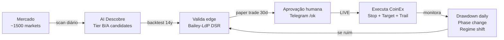
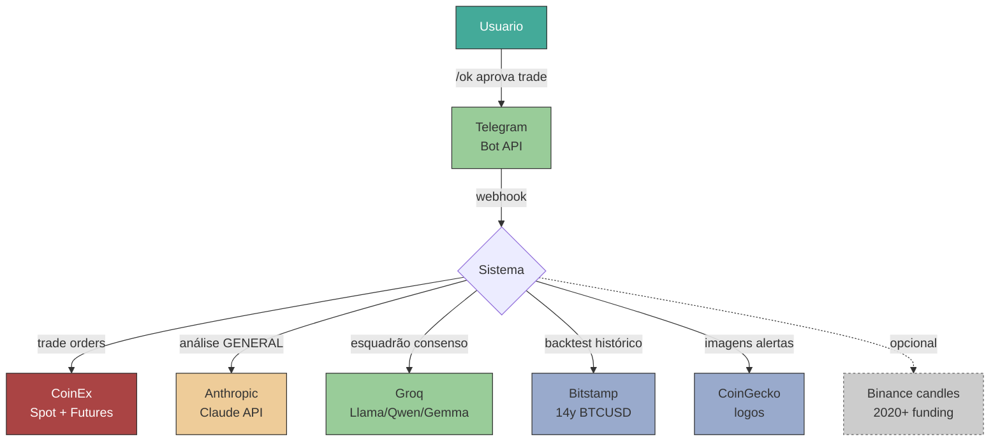
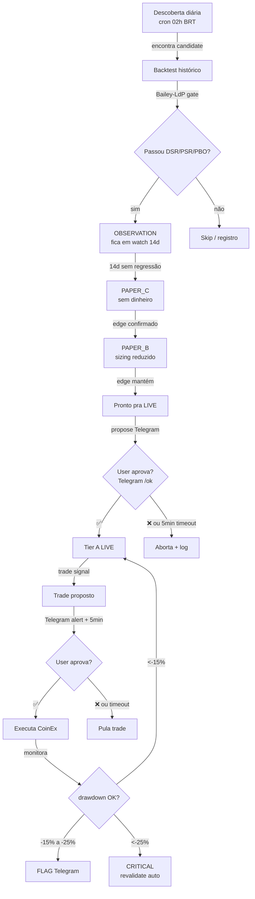

# HANDBOOK — Manual operacional ManuHeadFund

> **Para quem é este doc:** humano (gestor, operador, contador, advogado), AI assistente, ou novo contribuidor que precisa entender a ferramenta **de fora pra dentro** — quais serviços, quanto custa, quem decide o quê, o que monitorar.
> **Não é doc técnica.** Para detalhes técnicos: [docs/PROJECT_MAP.md](docs/PROJECT_MAP.md) + [docs/ARCHITECTURE_TATICA.md](docs/ARCHITECTURE_TATICA.md).
> **Última atualização:** 2026-05-19.

---

## 🎯 O que esta ferramenta faz

Sistema autônomo que **descobre, valida e executa trades de crypto** na exchange CoinEx, com aprovação humana via Telegram em cada trade real.

**Capital atual:** definido por user no `agents/config.local.ps1`.
**Modo:** LIVE (real money) desde 2026-05-18.
**Markets ativos (Tier A LIVE):** ZEC, BTCUSD, BTCUSDT, INJ, PENDLE, CFG, RENDER (7 markets).

---

## 💵 Visão financeira

### Receitas / objetivo
- Meta: **$5k/mês em 3-5 anos** (plano de 36 meses)
- Trading é capital de multiplicação (user tem renda externa)
- Risco máximo por trade: **1% do capital total**

### Custos operacionais

| Categoria | Provider | Custo estimado | Notas |
|---|---|---|---|
| LLM (decisão trades) | **Anthropic** (Claude) | ~$5-15/mês | Cascade V6: Groq grátis → Claude $0.005/trade |
| LLM (esquadrão) | **Groq** | $0 | llama-3.3-70b + qwen-qwq-32b + gemma2-9b (free tier) |
| Exchange fees | **CoinEx** | 0.20% taker / 0.10% maker | Aplicado em todos os trades |
| Slippage típico | — | ~0.10% por lado | Markets líquidos (vol > $500K) |
| Telegram Bot | **Telegram** | $0 | API gratuita |
| Hosting | (atualmente local) | $0 | Roda no PC do user. Plano: VPS ~$5/mês |
| Domínio (futuro) | TBD | ~$10/ano | Quando lançar produto |

### Drawdown / circuit breaker
- **Equity stop -10R** → pausa 24h trades
- **Drawdown -15% no Tier A** → flag Telegram + investiga
- **Drawdown -25% no Tier A** → revalidação automática imediata
- **Drawdown -10% global capital** → user decide manualmente

---

## 🔗 Serviços externos (vendor map)

### Detalhe por vendor

#### 🔴 CoinEx (crítico — sem ele, não opera)
- **Tipo:** exchange (Spot + Futures)
- **Owner:** Haipo Yang (ViaBTC)
- **API key:** principal com **trade + withdraw** (atenção: withdraw permission!)
- **Whitelist IP:** ❌ não configurado (TODO: adicionar quando tiver VPS fixo)
- **Fees:** 0.20% taker, 0.10% maker
- **Histórico de incidentes:** hot wallet hack já mitigado (ver `knowledge/COINEX_REFERENCE.md`)
- **Compliance:** MiCA EU 2026-07 (em monitoramento)
- **Doc canônica:** [knowledge/COINEX_REFERENCE.md](knowledge/COINEX_REFERENCE.md)

#### 💰 Anthropic Claude API (custos crescentes)
- **Uso:** análise final dos trades pelo GENERAL (persona Livermore + Tudor Jones)
- **Modelo:** `claude-sonnet-4-6` (default), `claude-opus-4-7` (para análises críticas)
- **Spending limit:** configurar via console Anthropic (recomendado $50/mês max)
- **Custo unitário:** ~$0.005/trade analisado
- **Bypass se falhar:** sistema continua com aprovação humana via Telegram (degrade gracioso)

#### 🟢 Groq (gratuito, mas pode mudar)
- **Uso:** esquadrão V6 — 3 modelos paralelos (TERMAL/RADAR/LIDAR)
- **Modelos:** llama-3.3-70b, qwen-qwq-32b, gemma2-9b-it
- **Rate limit:** free tier suficiente pra ~100 ciclos/dia
- **Risco:** Groq pode mudar pricing/rate limit. Fallback: pular esquadrão, ir direto Claude.

#### 🟢 Telegram (gratuito, crítico operacional)
- **Bot:** `@<seu_bot>` (gerenciado por user)
- **chat_id allowlist:** hardcoded em `tg_listener.ps1` (`$ALLOWED_CHAT`)
- **Comandos disponíveis:** /ask /status /markets /scan /halt /resume /idea /ideas /idea_cancel /phase /help
- **Uso:** aprovação manual de trades (✅/❌), alertas, conversação Claude
- **Sem Telegram:** sistema não pode executar trades (aprovação humana ausente)

#### 🔵 Bitstamp (dados históricos)
- **Uso:** 14 anos BTCUSD/ETHUSD/LTCUSD/XRPUSD para backtest
- **Coleta:** uma vez, salva em `backtest/*usd_bitstamp_1day.json`
- **Custo:** $0 (público)

#### 🟡 Cloudflare (mencionado, mas não no projeto atual)
- **Status atual:** **NÃO USADO** no projeto
- **Quando usar:** quando lançar plataforma web (newsletter PDF, dashboard)
- **Plano futuro:** Cloudflare Workers + R2 para hosting estático

---

## 👥 Quem decide o quê — fluxograma de governança

### Tipos de decisão

| Decisão | Quem decide | Como |
|---|---|---|
| Quais markets escanear | **AI automática** | `weekly_discovery.py` + critérios goldilocks |
| Qual estratégia/edge | **AI + backtest** | Bailey-LdP DSR/PSR/PBO/WF gates |
| Promote market pra LIVE | **HUMANO via Telegram** | `/ok` em 5min |
| Executar trade individual | **HUMANO via Telegram** | `/ok` em 5min, timeout = abort |
| Pausar sistema | **HUMANO** | `/halt` no Telegram |
| Revogar Tier A | **HUMANO** | Após drawdown -25% ou regime change |
| Ajustar capital/risk | **HUMANO** | Edit em `agents/config.local.ps1` |
| Mudança de phase halving | **AI detecta** | Alert Telegram, sem ação automática |
| Regime BTC muda | **AI detecta + ajusta** | MCE multiplica context_score automaticamente |

---

## 🔄 Operação diária — checklist humano

### Manhã (8h-10h BRT)
1. ☐ Abrir Telegram, ler alertas overnight
2. ☐ Conferir relatório do cron 02h BRT no `journal/promotion_cron.log`
3. ☐ Se houve `/idea` criada ontem com trigger fired: revisar
4. ☐ Conferir drawdown Tier A LIVE no Telegram

### Durante o dia
1. ☐ Notificações Telegram quando trade proposto → decidir ✅/❌ em 5min
2. ☐ Pulse check no `/status` se sentir necessidade
3. ☐ Trade urgente fora do scope? `/idea MARKET PRICE` cria alerta

### Fim do dia
1. ☐ Conferir `journal/trades.csv` (trades executados)
2. ☐ Conferir `journal/cost_tracker.jsonl` (custo LLM)
3. ☐ Anotar em journal pessoal se algo notável aconteceu

### Domingo (semanal)
1. ☐ Cron roda discovery + revalidation automaticamente 02h
2. ☐ Conferir promoções propostas (Telegram propose, decidir)
3. ☐ Revisar Tier A LIVE — algum precisa demote?

### Mensal
1. ☐ Auditoria segurança: rodar checks de [SECURITY.md](SECURITY.md)
2. ☐ Conferir spending limit Anthropic (console)
3. ☐ Backup encriptado das keys (offline)
4. ☐ Revisar memory `project_status_now.md` — está atualizada?

### Trimestral
1. ☐ Rotacionar API keys (CoinEx + Anthropic)
2. ☐ Conferir validade da chave principal CoinEx (regenerar antes de vencer)
3. ☐ Revisar IP whitelist (CoinEx + VPS)

---

## 🚨 Procedimentos de emergência

### Sistema fez trade ruim que escapou da aprovação
1. **Imediato:** `/halt` no Telegram
2. Conferir `journal/trades.csv` última linha
3. Fechar manualmente na CoinEx (UI ou API)
4. Investigar: foi bug no gate humano? Log em `logs/`

### Vazamento de credencial suspeito
1. **Revogar** key na UI CoinEx imediatamente
2. **Regerar** key nova
3. Atualizar `agents/config.local.ps1`
4. Rodar grep de auditoria (ver [SECURITY.md](SECURITY.md))
5. Conferir últimos trades — atividade suspeita?

### CoinEx fora do ar
1. Sistema vai falhar gracefully (timeouts), trades ficam pending
2. Conferir https://status.coinex.com
3. Se prolongado: posições em risco precisam stop manual

### Claude API quota excedida
1. Sistema cai pro fallback Groq (esquadrão V6)
2. Não bloqueia trades — só perde camada GENERAL
3. Resolver no console Anthropic (aumentar limit)

### Telegram bot offline
1. Sistema **NÃO EXECUTA TRADES** sem aprovação humana
2. Trades ficam pending até bot voltar
3. Conferir `scripts/watchdog_paper.ps1` (auto-respawn)
4. Forçar restart: `pwsh scripts/telegram_listener.ps1`

### Conta CoinEx bloqueada
1. Suporte CoinEx via chat oficial (não trusted bots)
2. Possíveis causas: KYC update needed, AML flag, IP suspeito
3. Sistema pausa tudo automaticamente em failed auth

---

## 📊 KPIs operacionais a monitorar

| KPI | Onde ver | Threshold |
|---|---|---|
| Trades/semana | `journal/trades.csv` | 3-15 (normal) |
| Win rate | observations.csv | >50% |
| Avg R per trade | observations.csv | >+0.4R |
| Drawdown atual | tier_a_drawdown_<DATE>.json | <-15% flag, <-25% crit |
| Custo LLM mês | cost_tracker.jsonl | <$20/mês |
| Tempo até /ok médio | tg_listener.log | <2min ideal |
| Markets Tier A LIVE | per_asset_whitelist_*.json | 5-10 |
| Halving phase | halving_phase_state.json | atualizar quando muda |

---

## 🛠️ Stack técnico (resumo p/ humano)

| Camada | Tech | Por quê |
|---|---|---|
| Orquestração | PowerShell 5.1 | Windows nativo, sem deps Linux |
| Backtest | Python 3.12 | numpy/scipy, pytest, ML libs |
| Bot Telegram | PowerShell + Bot API | Tudo em PS pra unificar |
| Storage | JSON + JSONL + CSV | Plain text, sem DB pesado |
| Exchange | CoinEx API v2 | REST + WebSocket (atual: só REST) |
| LLM cascade | Groq (free) → Claude (paid) | Custo otimizado |
| Schedule | Windows Task Scheduler | Nativo, 02h BRT diário |

**Sem:** Docker, Kubernetes, banco SQL, mensageria, microsserviços. **Filosofia: simples > distribuído.**

---

## 📚 Onde mais saber

- **Quero programar:** [docs/PROJECT_MAP.md](docs/PROJECT_MAP.md), [AGENTS.md](AGENTS.md), [docs/ARCHITECTURE_TATICA.md](docs/ARCHITECTURE_TATICA.md)
- **Quero entender filosofia de trading:** [BLUEPRINT.md](BLUEPRINT.md), [knowledge/](knowledge/), [knowledge/MENTOR.md](knowledge/MENTOR.md)
- **Quero segurança:** [SECURITY.md](SECURITY.md)
- **Quero saber estado vivo:** memory `project_status_now.md` em `~/.claude/projects/.../memory/`
- **Quero ler decisões recentes:** memory `MEMORY.md` no mesmo dir

---

## 📝 Glossário rápido

| Termo | Significado |
|---|---|
| **Tier A LIVE** | Markets com dinheiro real autorizado pra trade |
| **Tier B PAPER** | Markets em paper trade (sem $) testando edge |
| **Tier C SKIP** | Markets testados e rejeitados |
| **Edge** | Vantagem estatística sobre o mercado |
| **Bailey-LdP** | Metodologia López de Prado: DSR/PSR/PBO/WF anti-overfitting |
| **DSR** | Deflated Sharpe Ratio (penaliza multi-testing) |
| **MCE** | Market Context Engine (modula trades por contexto) |
| **Halving phase** | Fase do ciclo halving Bitcoin (1_bull / 2_top / 3_bear / 4_recovery) |
| **strict_v3** | Whitelist atual (BULL_STRONG + TRANSITION_UP Mon + BULL_WEAK condicional) |
| **GENERAL** | Persona Claude (Livermore + Tudor + Druckenmiller) que valida trade final |
| **/ok** | Comando Telegram pra aprovar trade (timeout 5min = abort) |
| **DRY trade** | Trade simulado, paper, sem dinheiro real |
| **Idea trigger** | Alerta de preço criado pelo user via `/idea MARKET PRICE` |
